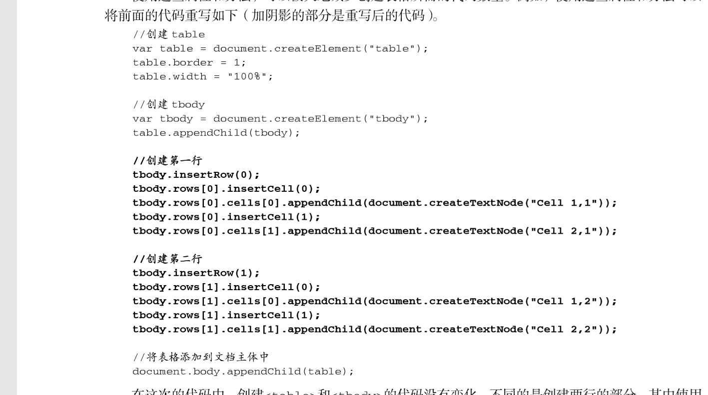
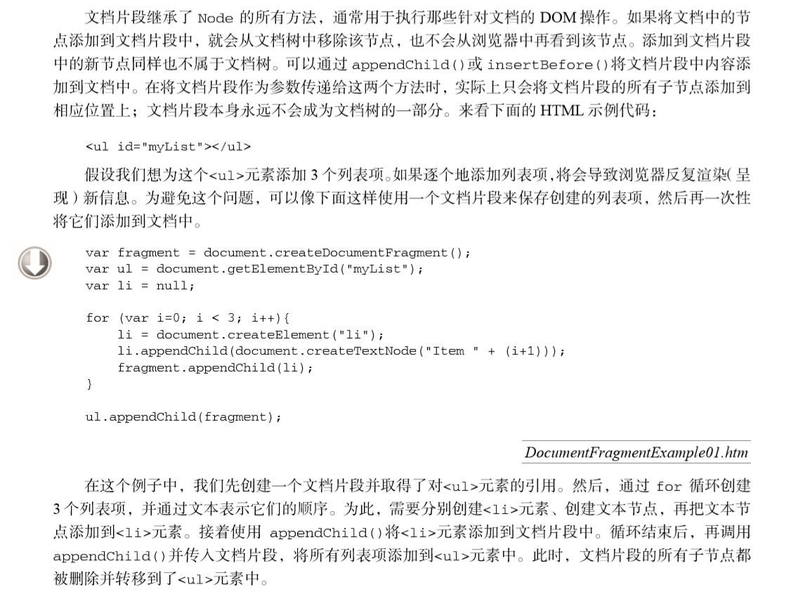

## DOM
[TOC]
### 什么是DOM
> Document Object Model  简称`DOM`--------`文档树模型`
> JavaScript通过DOM来操作HTML,`DOM提供API`
> 其中API是可以自己扩展的,只是不一定以后会添加到浏览器里边而已

#### `节点类型和节点的简单操作`
> + 有兼容性,出来的结果可能会有些出入,`见代码示例`
> + 都是只读属性,不可更改

#### .children
> + 只能获取子代,没有孙代
> + 通过下标访问
> + 是一个动态的

#### `.parentNode`
> + 获取父级,只有一个,可以一直往上找

#### 所有后代
> + oBox.getElementsByTagName(" `*` ");

#### 子节点`.childNodes[x]`
> + 所有的子节点,`包含回车`

#### 节点类型`.nodeType`
> + 一共有12中节点类型,但是常用的只有5种
> + 分别是: 标签节点/元素节点  1  文本节点 3     注释节点 8     属性节点 2  文档节点 9

#### 元素节点类型的查看`.childNodes[x].nodeType`
> + 文本节点 注释节点 **等**  `都是这样访问的`

#### 属性节点类型的查看`.attribute[x].nodeType`
> + 必须写下标,否则是undefined
> + 三种属性名: `name id class`

#### 值`(只对文本节点有效)`
> + **`.`**nodeValue
> + 如果不是文本节点,则返回值是`null`

#### `属性节点的操作`
>+ 获取 ： obj.getAttributeNode() 方法获取`指定`的属性节点。
>+ 创建 ： document. createAttribute(name)  `创建拥有指定名称`的属性节点，并返回新的 Attr对象
>+ 添加 ： obj.setAttributeNode() 方法向元素中添加指定的属性节点。
>+ 可以添加,然后操作css样式,`js不可以操作`,因为`操作的不是元素节点`,而是属性节点
> + **这个方法很少用到**
**`示例`**

    <div id="box">
            1111
            <p></p>
            <a href=""></a>
            <div class="fff"></div>
            <!---->
    </div>
    <script>
            var oBox = document.getElementById("box");
            //子元素,是一个集合(数组)
            console.log(oBox.children[0]);//<p></p>
            console.log(oBox.children[0].tagName ==="P" );//true
            console.log(oBox.children[2].nodeName);//DIV
            console.log(oBox.children[2].nodeName ==="SPAN");//false
            console.log(oBox.children.length);//长度是3
            //父元素,单个对象
            console.log(oBox.parentNode);//<body></body>
            //////////////////////////////////////
            //以下这两个有兼容性,出来的结果和主流浏览器不一样,IE只出来长度
            //所有后代，没有文本节点
            var a = oBox.getElementsByTagName("*");
            console.log(a);//p a input
            //所有子节点
            var b = oBox.childNodes;
            console.log(b);
            //text, p, text, a, text, input, text, comment, text  
            //回车也算
            ///////////////////////////////////////
            //标签节点
            var c = oBox.childNodes[1].nodeType;
            console.log(c);//1
            //文本节点
            var d = oBox.childNodes[0].nodeType;
            console.log(d);//3
            //注释节点
            var f = oBox.childNodes[7].nodeType;
            console.log(f);//8
            //属性节点
            var I = oBox.attributes[0].nodeType;//2
            console.log(I);
            //节点名称
            var g = oBox.nodeName;
            console.log(g);//DIV
            //节点名称
            var h = oBox.childNodes[1].nodeName;
            //下标0是#text,下标1是P,下标最大是8
            console.log(h);
            //值nodeValue,只对文本节点有效
            var k = oBox.childNodes[1].nodeValue;
            console.log(k);//111
            //创建属性
            var _class = document.createAttribute("class");
            _class.value = "hello";
            oBox.children[1].setAttributeNode(_class);
            var yy = oBox.children[1].getAttributeNode("class");
            console.log(yy);//hello
            yy.style.color = "red";//报错,非法属性不可以这样用
            var _class = oBox.children[2].getAttribute("class");
            console.log(_class);//fff
            _class.style.border = "1px solid red";
            //报错,合法属性也不可以这样写,因为操作的是属性节点,而不是元素节点
        </script>

### 节点的操作`(一般操作元素节点)`
#### firstChild`/firstElementChild`第一个子节点
>有兼容性  : `IE678用firstChild( )`         ` firstElementChild( )主流浏览器用`
>+ firstElmentChild( );`是只读属性`
> + 这个方法有些鸡肋;因为可以使用`.children`方法,然后通过`下标`访问,还没有兼容性
> + **没有则返回null**
#### lastChild`/lastElementChild`最后一子节点
> + 同上
> + 使用`.children[oBox.children.length-1]`也一样

#### nextSibling`/nextElementSibling`下一个兄弟节点
> + 同上
> + 获取不到返回null 


	//在当前的元素节点没有了,可以避免获取到文本节点,但是会报错	
	var oBox = document.getElementById("box");
	var oA = oBox.children[2];
	var oSpan = nextSibling(oA);
	console.log(oA);
	oSpan.innerHTML = "999";//报错
	function nextSibling( obj ){
	    return obj.nextElementSibling === undefined?obj.nextSibling:obj.nextElementSibling;//没有就是他自己,有时下一个
	}

#### previousSibling`/previousElementSibling`上一个兄弟节点
> + 同上

#### 最近定位父级`offsetParent`
> + 在火狐里和IE7有兼容性

    <body>
        <div id="box">
            111
            <p>
                <a href=""></a>
            </p>
            <span></span>
            ccc
        </div>
        <script>
                * 在没有定位和只有绝对定位的时候,
                * offsetParent的返回值都是body
                * 有相对定位的时候,offsetParent的返回值是上一个定位的父级,
                * (有固定定位也一样);
                * 固定定位:fixed火狐返回body,而其他浏览器返回null
                * 在有haslayout的元素中时
                * ,IE7会有问题会返回具有haslayout的标签时,其他返回body
                /////////////////////////////////
                var oBox = document.getElementById("box");
                var oA = oBox.getElementsByTagName("a")[0];
                //绝对定位 相对定位 固定定位 返回值都一样
                console.log(oA);// <div id="box"></div>
                var _offsetParent = oA.offsetParent;
                console.log(_offsetParent);
        </script>
    </body>


#### `子节点的个数`
- **obj.childElementCount**
> + 只会返回长度,其他的与`.children`一样
> + 都不会返回文本节点,只返回元素节点

    <body>
        <ul id="box">
            <li></li>
            <li></li>
            <li></li>
            <li></li>
            <li></li>
        </ul>
        <script>
            var oBox = document.getElementById("box");
            //只会返回长度
            console.log(oBox.childElementCount);//5
            //会返回节点名称以及长度
            console.log(oBox.children);//(5) [li, li, li, li, li]
        </script>
    </body>

#### `克隆节点(元素)`.clone( )
> +  element .cloneNode()  参数` true`克隆元素及后代 不会克隆属性及事件，`false克隆本元素`

###增删改节点`(元素节点)`
> + 通过`document.createElement( )` ;创建   括号内写标签名,字符串类型
> + 必须通过`document`来创建,其他不支持
> + 可以多写,但必须重新`var`

**`写入页面.appendChild(new)`** **`删除.removeChild(old)`**  
**替换`.replaceChild(new,old)`,需要创建一个新的标签**
**`在某个的前面.insertBefore(插入的元素,在谁的前面)`**
> + **`在最前面添加,不管他有没有子元素(null undefined都可以)`**
> +  **`insertBefore(插入的元素,父级.children[0]`**

    <body>
        <div id="box"></div>
        <div id="wrap"></div>
        <script>
            var oBox = document.getElementById("box"),
                oWrap= document.getElementById("wrap");
            var oP = document.createElement("p");
            oP.innerHTML = "11111";
            oBox.appendChild(oP);
            var oP = document.createElement("p");
            oP.innerHTML = "2222";
            oWrap.appendChild(oP);
        </script>
    </body>
    /////////////\\\\\\\\replaceChild(new,old)
    <body>
        <div id="box">
            <p></p>
        </div>
        <script>
            var oBox = document.getElementById("box");
            var oP = oBox.children[0];
            var oSpan = document.createElement("span");
            oBox.replaceChild(oSpan,oP);
        </script>
     </body>
#### insertAfter`(自己写的)`

    /*
    	在某一个元素插入
    	ele : 在当前的元素节点后面插入 object
    	eleType : 要插入的新元素    string
    */
    function insetAfter(ele,eleType){
        var parent = ele.parentNode,
            newEle = document.createElement(eleType);
        if( parent.children[parent.children.length-1] === ele ){
                parent.appendChild(newEle);
        }else{
            parent.insertBefore(newEle,ele.nextSibling||ele.nextElementSibling);
        }
    }

###各种元素的宽高
#### `实际的宽和高`
**scrollHeight/Width**
> + 各个浏览器的表现可能不一样
> + **`overflow: hidden`**不会影响返回值

    <style type='text/css'>
            *{
                margin: 0;
                padding: 0;
            }
            #box{
                overflow: hidden;
                width: 100px;
                height: 100px;
                padding: 10px 20px;
                border: 1px solid red;
                background: green;
            }
            .c{
                width: 200px;
                height: 200px;
                background-color: red;
            }
        </style>
    </head>
    <body>
        <div id="box">
            <div class="c"></div>
        </div>
        <script>
            var oBox = document.getElementById("box");
            //谷歌 210  火狐  210 IE  210    overflow:hidden不会影响返回值
            console.log(oBox.scrollHeight);
        </script>
    </body>

#### `offsetTop和offsetLeft`定位父级的top和left
> + 没有`offsetRight`和`offsetBottom`
> + 到定位父级的高和左边的距离
> + 是一个**只读**属性

    <style type='text/css'>
            html,body{
                width: 100%;
                height: 100%;
            }
            #box{
                position: relative;
                width: 100%;
                height: 100%;
            }
            p{
                position: absolute;
                left: 0;
                right: 0;
                bottom: 0;
                top: 0;
                margin: auto;
                width: 100px;
                height: 100px;
                background: green;
            }
        </style>
        <body>
            <div id="box">
                <p></p>
            </div>
            <script>
                var oBox = document.getElementById("box");
                console.log( oBox.children[0].offsetTop );
                console.log( oBox.children[0].offsetLeft );
            </script>
    </body>
####  获取元素的距离文档定位父级顶部的距离
#### offsetTop/offsetLeft
`offsetLeft :`**获取对象相对于 offsetParent (left)位置**
`offsetTop :`**获取对象相对于offsetParent(top)位置**

    <script>
       var oBox = document.getElementById("box");
       console.log(oBox.offsetWidth);//width+padding+border
       console.log(oBox.clientWidth);//width+padding
    </script>

#### offsetWidth/ offsetHeight 可视宽高
> **offsetHeight:** `对象 height + padding + border`
> **offsetWidth:** `对象width + padding + border   ==> 不包含子元素（一致）`

#### `浏览器的可视宽高`
**document.documentElement.client`Width/Height`**
> 没有兼容性,但是**返回值在IE9**(不包括)以下的`返回值不一样`

    <script>
        document.write(document.documentElement.clientWidth);
    </script>

#### offsetParent 定位父级
**获取元素 最近的定位父级  如果没有定位父级 `则参考 body` （ 元素必须是`定位元素`）**


#### 屏幕分辨率,`window.screen.Width`
> + 没有兼容性
> + 值不会变,与浏览器窗口大小没关系

    <script>
       document.write(window.screen.width);//没有兼容性
    </script>


#### 去除任务栏的分辨率`window.screen.availWidth`
> + 用高度就可以看出来
> + 和浏览器的宽高没有任何关系
> + 它只是一个分辨率

    <script>
          console.log(window.screen.availWidth);
    </script>

#### window.outerWidth`/`Height,`浏览器的宽高`**
#### window.innerWidth`/`Height,`浏览器的宽高`**
> + 有兼容性,IE8及以下出来的是`undefined`
> + 出来的值各不相同
> + 两个方法的返回值也不相同

    <body>
        <script>
            alert(window.innerHeight);
            alert(window.outerHeight);
        </script>
    </body>

#### `scrollTop/scrollLeft` 滚动宽,滚动高
> 1. 可读可写 ，
>  1. 有兼容   
> 1. 有内容溢出元素才有效果  ele. scrollTop  元素Y轴滚动的距离   
> 1. ele. scrollLeft  元素X轴滚动的距离 
> 1. 设置时不能给px 单位，否则会出错
> 1. 可以用来模拟在IE下的**pageX和pageY**;

    <body style="height: 2000px;">
        <script>
            function fn(){
                console.log(document.documentElement.scrollTop);
            }
            addEventListener("wheel",fn,false);
            //wheel在IE8及以下有兼容性
            //这个更好
            window.onscroll = function(){
                console.log(document.documentElement.scrollTop || document.body.scrollTop);
            }
        </script>
    </body>

> 兼容

    document.documentElment.scrollTop || document.body.scrollTop
#### page
- 获取鼠标到文档**document**顶部的位置`(x,y)`
- `IE8下`的兼容**(用scrollTop和scrollLeft来模拟)**

    document.onclick = function(e){
   		e = e || window.event;
   		if(!e.pageY){//为IE8
   			console.log(document.documentElement.scrollTop + e.clientY)
   		}else{
   			console.log(e.pageY);
   		}
   	};

#### scrollWidth/ scrollHeight 可视宽高
>  **scrollWidth**对象的 `width + padding`  
> **scrollHeight** 应该等用于 `scrollTop + clientHeight` 如果元素没有隐藏的部分，则相关的值应该等用于**clientWidth**和**clientHeight   scrollHeight**对象的`height + padding(top+bottom)`,**否则**是就是height+`padding(top)`  
> **==>** 包含 `子元素内容 , 子元素定位`, overflow:hidden（一致）


###元素方法
#### `getboundingClientRect()`
**得到一个矩形界线`(矩阵)`,返回的是一个对象(json)**
`返回top,left,bottom,right,width,height,x,y`
- 可以用`obj.getBoundingClientRect().width`的方式来获取自己想要的值

    <style type='text/css'>
            *{
                margin: 0;
                padding: 0;
            }
            body,html{
                position: relative;
                width: 100%;
                height: 100%;
            }
            #box{
                position: absolute;
                top: 0;
                left: 0;
                bottom: 0;
                right: 0;
                margin: auto;
                width: 100px;
                height: 100px;
                background: green;
            }
        </style>
    </head>
    <body>
        <div id="box"></div>
        <script>
            var oBox  = document.getElementById("box");
            console.log(oBox.getBoundingClientRect());
            //height:100;left:910;
            //right:1010;top:-50;width:100;x:910;y: -50;
            ///////////////////////////////////////////////
            //只显示left,right,top,width,height,x到左边的距离,y到顶部的距离
        </script>
    </body>


#### `scrollIntoView()`滚到可视区域

    <script type="text/javascript">
            window.onload = function(){
                /*
                    如何滚动页面也是DOM没有解决的一个问题。
                    为了解决这个问题，浏览器实现了一下方法，
                以方便开发人员如何更好的控制页面的滚动。
                在各种专有方法中，HTML5选择了scrollIntoView()
                作为标准方法。
                scrollIntoView()可以在所有的HTML元素上调用，
                通过滚动浏览器窗口或某个容器元素，
                调用元素就可以出现在视窗中。如果给该方法传入true作为参数，
                或者不传入任何参数，那么
                窗口滚动之后会让调动元素顶部和视窗顶部尽可能齐平。
                如果传入false作为参数，调用元素
                会尽可能全部出现在视口中（可能的话，
                调用元素的底部会与视口的顶部齐平。）`不过顶部
                不一定齐平`，例如：
                //让元素可见
                document.forms[0].scrollIntoView();
                当页面发生变化时，一般会用这个方法来吸引用户注意力。
                实际上，为某个元素设置焦点也
                会导致浏览器滚动显示获得焦点的元素。
                支持该方法的浏览器有 IE、Firefox、Safari和Opera。
                */


                var  roll1 = document.querySelector("#roll1"),
                     roll_top = document.querySelector("#roll_top"),
                     roll2 = document.querySelector("#roll2")
                roll1.onclick = function(){
                    roll_top.scrollIntoView(false);
                }
                roll2.onclick = function(){
                     roll_top.scrollIntoView(true);
                }
            }
        </script>
        <style type="text/css">
            #myDiv{
                height:900px;
                background-color:gray;
    
            }
            #roll_top{
                height:900px;
                background-color:green;
                color:#FFF;
                font-size:50px;
                position:relative;
            }
            #bottom{
                position:absolute;
                display:block;
                left: 0;
                bottom:0;
            }
        </style>
    </head>
    <body style="2000px">
    <button id="roll1">scrollIntoView(false)</button>
    <button id="roll2">scrollIntoView(true)</button>
    <div id="myDiv"></div>
    <div id="roll_top">
        scrollIntoView( true )元素上边框与视窗顶部齐平
        <span id="bottom">scrollIntoView(false)元素下边框与视窗底部齐平</span>
    </div>
    </body>


#### `鼠标位置`e.clientX,e.clientY

    document.onclick = function(e){
         e = e|| window.event;//兼容IE
         document.title = e.clientX+","+e.clientY;
         //document.title    IE中这个无法调用
     }
### 操作表格
- 为了方便构建表格，HTML DOM还为**table**、`tbody` 和 **tr** 元素添加了一些属性和方法。 
#### table
- 为<table>元素添加的属性和方法如下。 
>  caption：保存着对<caption>元素（如果有）的指针。 
>  tBodies：是一个<tbody>元素的 HTMLCollection。 
> tFoot：保存着对<tfoot>元素（如果有）的指针。 
> tHead：保存着对<thead>元素（如果有）的指针。 
> rows：是一个表格中所有行的 HTMLCollection。 
> createTHead()：创建<thead>元素，将其放到表格中，返回引用。 
> createTFoot()：创建<tfoot>元素，将其放到表格中，返回引用。 
> createCaption()：创建<caption>元素，将其放到表格中，返回引用。 
> deleteTHead()：删除<thead>元素。 
> deleteTFoot()：删除<tfoot>元素。 
> deleteCaption()：删除<caption>元素。 
> deleteRow(pos)：删除指定位置的行。 
> insertRow(pos)：向 rows 集合中的指定位置插入一行。 
#### tbody
- 为<tbody>元素添加的属性和方法如下。 
> rows：保存着<tbody>元素中行的 HTMLCollection。 
> deleteRow(pos)：删除指定位置的行。 
> insertRow(pos)：向 rows 集合中的指定位置插入一行，返回对新插入行的引用。
#### tr
- 为<tr>元素添加的属性和方法如下。 
> cells：保存着<tr>元素中单元格的 HTMLCollection。 
>  deleteCell(pos)：删除指定位置的单元格。
>  insertCell(pos)：向 cells 集合中的指定位置插入一个单元格，返回对新插入单元格的引用。


### DocumentFragment`(碎片化)`
#### 特点
- 只有DocumentFragment 在文档中**没有对应**的标记
- DOM 规定文档片段 （document fragment）是一种“轻量级”的文档，可以包含和控制节点，但不会像完整的文档那样**占用额外的资源**
#### DocumentFragment 节点具有下列特征： 
> 1.  nodeType 的值为 11；
> 2. nodeName 的值为"#document-fragment"；
> 3. nodeValue 的值为 null； 
> 4. parentNode 的值为 null； 
> 5. 子节点可以是 Element、ProcessingInstruction、Comment、Text、CDATASection 或 EntityReference
> 6. 不可以直接添加到文档中,但是可以把它当做一个仓库来使用,**即可以在里面保存将 来可能会添加到文档中的节点**

####  document.createDocumentFragment()方法

```js
var fragment = document.createDocumentFragment(); 
```


- 示例

    ```js
    var fragment = document.createDocumentFragment(); 
    
    var ul = document.getElementById("myList"); 
    
    var li = null; 
    
    for (var i=0; i < 3; i++){     
    
    	li = document.createElement("li");     
    
    	li.appendChild(document.createTextNode("Item " + (i+1)));     
    
    	fragment.appendChild(li); 
    
    } 
    
    ul.appendChild(fragment);   
    
    ```

    

