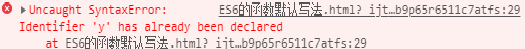

## ES6函数的扩展
[TOC]

### 函数参数的默认值

### 基本用法

#### 之前的写法

- ES6 之前，不能直接为函数的参数指定默认值，只能采用变通的方法

    ```js
    function log(x, y) {
    
    	  y = (typeof y === "undefined")? "World" : y;
    
    	  console.log(x, y);
    
    }
    
    	
    
    log('Hello') // Hello World
    
    log('Hello', 'China') // Hello China
    
    log('Hello', '') // Hello World
    
    ```

    

- ES6写法(`简单明了`)

    

    ```js
    function log(x, y = 'World') {
    
      console.log(x, y);
    
    }
    
    log('Hello') // Hello World
    
    log('Hello', 'China') // Hello China
    
    log('Hello', '') // Hello
    
    ```
> **注意:**
> + 此时的x和y都不可以再使用`let`和`const`命令**重新命名**了
> + 如果写了,那么会提示`已经声明过该对象了`
> + 
> + 参数是**惰性求值**,会先计算在赋值

#### 与解构赋值默认值结合使用

    function foo({x, y = 5}) {
      console.log(x, y);
    }
    
    foo({}) // undefined 5
    foo({x: 1}) // 1 5
    foo({x: 1, y: 2}) // 1 2
    foo() // TypeError: Cannot read property 'x' of undefined

- 在实参内一定要写上`{}`,否则一定报错
- 但是,使用这种方式是可以不用在实参内传`{}`的

    // 写法一     不传参   默认{x = 0, y = 0}
	function m1({x = 0, y = 0} = {}) {
	  return [x, y];
	}
	
	// 写法二    不传参   默认{}
	function m2({x, y} = { x: 0, y: 0 }) {
	  return [x, y];
	}
	
	//结果
	// 函数没有参数的情况
	m1() // [0, 0]
	m2() // [0, 0]
	
	// x 和 y 都有值的情况
	m1({x: 3, y: 8}) // [3, 8]
	m2({x: 3, y: 8}) // [3, 8]
	
	// x 有值，y 无值的情况
	m1({x: 3}) // [3, 0]
	m2({x: 3}) // [3, undefined]
	
	// x 和 y 都无值的情况
	m1({}) // [0, 0];
	m2({}) // [undefined, undefined]
	
	m1({z: 3}) // [0, 0]
	m2({z: 3}) // [undefined, undefined]
#### 参数默认值的位置

> 1. 通常情况下，定义了默认值的参数，应该是函数的**尾参数**。
> 2. 因为这样比较容易看出来，到底`省略了哪些参数`。
> 3. 如果非尾部的参数设置默认值，实际上这个参数是`没法省略`的。

    // 例一
    function f(x = 1, y) {
      return [x, y];
    }
    
    f() // [1, undefined]
    f(2) // [2, undefined])
    f(, 1) // 报错
    f(undefined, 1) // [1, 1]
    
    // 例二
    function f(x, y = 5, z) {
      return [x, y, z];
    }
    
    f() // [undefined, 5, undefined]
    f(1) // [1, 5, undefined]
    f(1, ,2) // 报错
    f(1, undefined, 2) // [1, 5, 2]

#### 函数的 length 属性

> 1. 指定了默认值以后，函数的length属性，`将返回没有指定默认值的参数个数`。
> 1. 也就是说，指定了默认值后，**length属性将失真**
> 1. 也就是不可以再用函数的length属性了

    (function (a) {}).length // 1
    (function (a = 5) {}).length // 0
    (function (a, b, c = 5) {}).length // 2

- fn.length 返回形参个数,形参个数指的是**没有默认值**得形参
- arguments.length 返回实参个数

#### *作用域

> 1. 一旦设置了参数的默认值，函数进行声明初始化时，参数会形成一个**单独的作用域**`在()内部`形成一个新的作用域
> 1. **等到初始化结束**，这个作用域就会消失。
> 1. 这种**语法行为**，在`不设置`参数默认值时，是不会出现的。

    var x = 1;
    
    function f(x, y = x) {
      console.log(y);
    }
    
    f(2) // 2

- 上面代码中，参数y的默认值等于变量x。
- 调用函数f时，参数形成一个单独的作用域。
- 在这个作用域里面，默认值变量x指向第一个参数x，而不是全局变量x，**所以输出是2**。

    let x = 1;
    
    function f(y = x) {
      let x = 2;
      console.log(y);
    }
    
    f() // 1

- 上面代码中，函数f调用时，参数y = x形成一个单独的作用域。
- 这个作用域里面，变量x本身没有定义，所以指向外层的全局变量x。
- 函数调用时，函数体内部的局部变量x影响不到默认值变量x。


    var x = 1;
    
    function foo(x = x) {
      // ...
    }
    
    foo() // ReferenceError: x is not defined

- 上面代码中，参数x = x形成一个单独作用域。
- 实际执行的是let x = x，由于**暂时性死区**的原因，这行代码会报错”x 未定义“。

    var x = 1;
    function foo(x, y = function() { x = 2; }) {
      var x = 3;
      y();
      console.log(x);
    }
    
    foo()//3
    x//1

- 如果将var x = 3的var去除，函数foo的内部变量x就指向第一个参数x，与匿名函数内部的x是一致的，**所以最后输出的就是2，而外层的全局变量x依然不受影响**。

    var x = 1;
    function foo(x, y = function() { x = 2; }) {
      x = 3;
      y();
      console.log(x);
    }
    
    foo() // 2
    x // 1

#### rest 参数

> 1. ES6 引入 rest 参数（形式为...变量名），用于获取函数的多余参数，这样就不需要使用arguments对象了。
> 1. rest 参数搭配的变量是一个数组，该变量将多余的参数放入数组中。

    function add(...values) {
      let sum = 0;
    
      for (var val of values) {
        sum += val;
      }
    
      return sum;
    }
    
    add(2, 5, 3) // 10

- arguments对象不是数组，而是一个类似数组的对象。
- 所以为了使用数组的方法，必须使用Array.prototype.slice.call先将其转为数组。
- rest 参数就不存在这个问题，它就是一个真正的数组，数组特有的方法都可以使用。
**下面是一个利用 rest 参数改写数组push方法的例子**

    function push(array, ...items) {
      items.forEach(function(item) {
        array.push(item);
        console.log(item);
      });
    }
  
    var a = [];
    push(a, 1, 2, 3)

**注意: **rest 参数之后不能再有其他参数（`即只能是最后一个参数`），否则会报错。

    // 报错
    function f(a, ...b, c) {
      // ...
    }

- 函数的length属性，不包括 rest 参数。

    (function(a) {}).length  // 1
    (function(...a) {}).length  // 0
    (function(a, ...b) {}).length  // 1

### 严格模式

> 从 ES5 开始，函数内部可以设定为严格模式。
> ES2016 做了一点修改，规定只要函数参数使用了默认值、解构赋值、或者扩展运算符，那么函数内部就`不能显式设定为严格模式`，否则会报错

#### name 属性

- 返回函数名。

    function foo() {}
    foo.name // "foo"

    var f = function () {}; // "f"

### 箭头函数

- 基本用法

- ES6 允许使用**“箭头”（=>）**定义函数。

    var f = v => v;
    //上面的箭头函数等同于
    var f = function(v) {
      return v;
    };

- 如果箭头函数不需要参数或需要多个参数，就使用**一个圆括号代表参数部分**。

    var f = () => 5;
    // 等同于
    var f = function () { return 5 };
    
    var sum = (num1, num2) => num1 + num2;
    // 等同于
    var sum = function(num1, num2) {
      return num1 + num2;
    };

- 如果箭头函数的代码块部分多于一条语句，就要使用**大括号将它们括起来**，并且`使用`return语句返回。

    var sum = (num1, num2) => { return num1 + num2; }

- 由于大括号被解释为代码块，所以如果箭头函数直接返回一个对象，`必须在对象外面加上括号，`否则会报错。

    // 报错
    let getTempItem = id => { id: id, name: "Temp" };
    
    // 不报错
    let getTempItem = id => ({ id: id, name: "Temp" });

#### 箭头函数使用注意点

####  箭头函数有几个使用注意点

> 1. 函数体内的this对象，就是定义时所在的对象，而不是**使用时所在的对象**
> 2. 不可以当作构造函数，也就是说，不可以使用`new命令`，否则会**抛出一个错误**
> 3. 不可以使用`arguments`对象，该对象在函数体内不存在。如果要用，可以用 rest 参数代替。
> 4. 不可以使用yield命令，因此箭头函数不能用作 **Generator** 函数。


- this指向的固定化，并不是因为**箭头函数内部有绑定this的机制**，实际原因是箭头函数`根本没有自己的this`，导致内部的this就是外层代码块的this。
- 正是因为它没有this，所以也**就不能用作构造函数**。

箭头函数转成 ES5 的代码如下。

    // ES6
    function foo() {
      setTimeout(() => {
        console.log('id:', this.id);
      }, 100);
    }
    
    // ES5
    function foo() {
      var _this = this;
    
      setTimeout(function () {
        console.log('id:', _this.id);
      }, 100);
    }
    //转换后的 ES5 版本清楚地说明了，箭头函数里面根本没有自己的this，而是引用外层的this。

由于箭头函数没有自己的this，所以当然也就**不能**用`call()、apply()、bind()`这些方法去改变this的指向。

#### 箭头绑定this
> 箭头函数可以绑定this对象，大大减少了显式绑定this对象的写法（call、apply、bind）。
> 箭头函数并不适用于所有场合
> 所以现在有一个提案，提出了“函数绑定”（function bind）运算符，用来取代**call、apply、bind调用**

> 函数绑定运算符是并排的两个冒号（::），双冒号左边是一个对象，右边是一个函数。该运算符会自动将左边的对象，作为上下文环境（即this对象），绑定到右边的函数上面。

```
foo::bar;
// 等同于
bar.bind(foo);

foo::bar(...arguments);
// 等同于
bar.apply(foo, arguments);

const hasOwnProperty = Object.prototype.hasOwnProperty;
function hasOwn(obj, key) {
  return obj::hasOwnProperty(key);
}
```

- 如果双冒号左边为空，右边是一个对象的方法，则等于将该方法绑定在该对象上面。

	var method = obj::obj.foo;
	// 等同于
	var method = ::obj.foo;
	
	let log = ::console.log;
	// 等同于
	var log = console.log.bind(console);
	如果双冒号运算符的运算结果，还是一个对象，就可以采用链式写法。
	
	import { map, takeWhile, forEach } from "iterlib";
	
	getPlayers()
	::map(x => x.character())
	::takeWhile(x => x.strength > 100)
	::forEach(x => console.log(x));

#### 函数参数的尾逗号

- ES2017 允许函数的**最后一个参数有尾逗号**（trailing comma）。

- 这样的规定也使得，函数参数与数组和对象的尾逗号规则，保持一致了。

    function clownsEverywhere(
      param1,
      param2,
    ) { /* ... */ }
    
    clownsEverywhere(
      'foo',
      'bar',
    );


