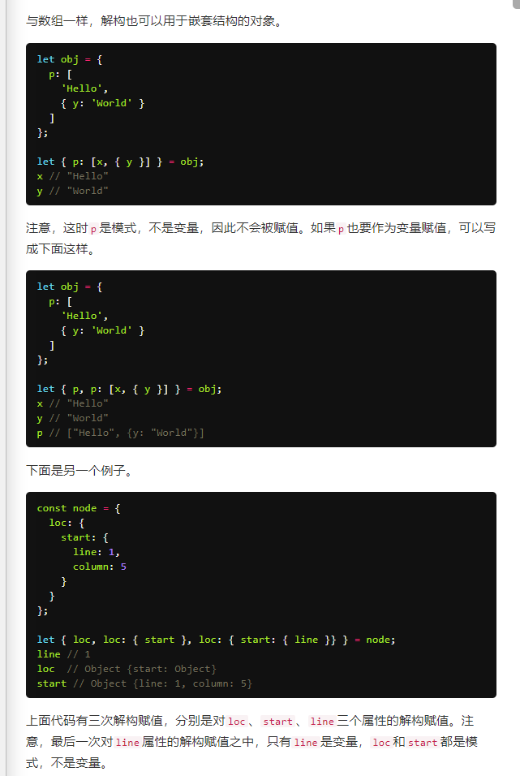

## ES6数组的解构赋值和`...`

### 基本用法

```
ES6 允许按照一定模式，从数组和对象中提取值，对变量进行赋值，这被称为解构（Destructuring）。
```

- es5一次声明多个变量

    var a = 1,
        b = 2,
        c = 3,
        ...;

- es6一次声明多个变量

    let [a,b,c] = [1,2,3];
    //a = 1
    //b = 2
    //c = 3

- 本质上，这种写法属于“**模式匹配**”，只要等号两边的模式相同，**左边的变量就会被赋予对应的值**。

    let [foo, [[bar], baz]] = [1, [[2], 3]];
    foo // 1
    bar // 2
    baz // 3
    
    let [ , , third] = ["foo", "bar", "baz"];
    third // "baz"
    
    let [x, , y] = [1, 2, 3];
    x // 1
    y // 3
    
    let [head, ...tail] = [1, 2, 3, 4];
    head // 1
    tail // [2, 3, 4]
    
    let [x, y, ...z] = ['a'];
    x // "a"
    y // undefined
    z // []

- 如果解构不成功，变量的值就等于**undefined**。

    let [foo] = [];
    let [bar, foo] = [1];
    //foo 都是undefined

- 另一种情况是**不完全解构**，即等号左边的模式，只匹配`一部分`的等号右边的数组。这种情况下，解构`依然`可以成功。

    let [x, y] = [1, 2, 3];
    x // 1
    y // 2
    
    let [a, [b], d] = [1, [2, 3], 4];
    a // 1
    b // 2
    d // 4
    
    //上面两个例子，都属于不完全解构，但是可以成功。

- 如果等号的右边不是数组，那么将会报错。两边的数据类型不一样**(细分)**

    // 报错
    let [foo] = 1;
    let [foo] = false;
    let [foo] = NaN;
    let [foo] = undefined;
    let [foo] = null;
    let [foo] = {};

### 默认值

#### 解构赋值允许指定默认值。

    let [foo = true] = [];
    foo // true
    
    let [x, y = 'b'] = ['a']; // x='a', y='b'
    let [x, y = 'b'] = ['a', undefined]; // x='a', y='b'

**`注意，ES6 内部使用严格相等运算符（===），判断一个位置是否有值。所以，如果一个数组成员不严格等于undefined，默认值是不会生效的。`**

    let [x = 1] = [undefined];
    x // 1
    
    let [x = 1] = [null];
    x // null

如果默认值是一个表达式，那么这个表达式是**惰性求值**的，即只有在用到的时候，才会求值,**而且优先级较低**

    function f() {
      console.log('aaa');
    }
    
    let [x = f()] = [1];
    //等价于
    let x;
    if ([1][0] === undefined) {
      x = f();
    } else {
      x = [1][0];
    }

- 默认值可以**引用解构赋值的其他变量**，但该变量必须已经声明。

    let [x = 1, y = x] = [];     // x=1; y=1
    let [x = 1, y = x] = [2];    // x=2; y=2
    let [x = 1, y = x] = [1, 2]; // x=1; y=2
    let [x = y, y = 1] = [];     // ReferenceError
    //上面最后一个表达式之所以会报错，是因为x用到默认值y时，y还没有声明

#### 对象的解构赋值

解构不仅可以用于**数组**，还可以用于**对象**。

    let { foo, bar } = { foo: "aaa", bar: "bbb" };
    foo // "aaa"
    bar // "bbb"
- 数组和对象的区别
> 1. 对象的解构与数组有一个重要的不同。数组的元素是按次序排列的，变量的取值由它的位置决定；
> 2. 而**对象的属性没有次序**，变量`必须`与`属性同名`，才能取到正确的值。

    let { bar, foo } = { foo: "aaa", bar: "bbb" };
    foo // "aaa"
    bar // "bbb"
    
    let { baz } = { foo: "aaa", bar: "bbb" };
    baz // undefined

- 如果`变量名与属性名不一致`，**必须写成**下面这样。

    let { foo: baz } = { foo: 'aaa', bar: 'bbb' };
    baz // "aaa"
    
    let obj = { first: 'hello', last: 'world' };
    let { first: f, last: l } = obj;
    f // 'hello'
    l // 'world'

- 实际上说明，对象的解构赋值是下面形式的简写

    let { foo: foo, bar: bar } = { foo: "aaa", bar: "bbb" };

**`也就是说，对象的解构赋值的内部机制，是先找到同名属性，然后再赋给对应的变量。真正被赋值的是后者，而不是前者。(优先级前者小于后者`**

    let { foo: baz } = { foo: "aaa", bar: "bbb" };
    baz // "aaa"
    foo // error: foo is not defined

- 与数组一样，解构也可以用于嵌套结构的对象。

    let obj = {
      p: [
        'Hello',
        { y: 'World' }
      ]
    };
    
    let { p: [x, { y }] } = obj;
    x // "Hello"
    y // "World"

- 对象的解构也可以**指定默认值**。

    var {x = 3} = {};
    x // 3
    
    var {x, y = 5} = {x: 1};
    x // 1
    y // 5
    
    var {x: y = 3} = {};
    y // 3
    
    var {x: y = 3} = {x: 5};
    y // 5
    
    var { message: msg = 'Something went wrong' } = {};
    msg // "Something went wrong"

- 默认值生效的条件是，**对象的属性值严格等于undefined**。

    var {x = 3} = {x: undefined};
    x // 3
    
    var {x = 3} = {x: null};
    x // null

- 如果解构模式是嵌套的对象，而且子对象所在的父属性不存在，那么将会报错。

    // 报错
    let {foo: {bar}} = {baz: 'baz'};
    //等号左边对象的foo属性，对应一个子对象。该子对象的bar属性，解构时会报错。原因很简单，因为foo这时等于undefined，再取子属性就会报错，
    
    //不过可以这样
    let { foo: baz } = { foo: 'aaa', bar: 'bbb' };
	baz // "aaa"
	
	let obj = { first: 'hello', last: 'world' };
	let { first: f, last: l } = obj;
	f // 'hello'
	l // 'world'
	
	//上面代码中，foo是匹配的模式，baz才是变量。真正被赋值的是变量baz，而不是模式foo。

- 由于数组本质是特殊的对象，因此可以对数组进行对象属性的解构。

    let arr = [1, 2, 3];
    let {0 : first, [arr.length - 1] : last} = arr;
    first // 1
    last // 3


### 字符串的解构赋值

    const [a, b, c, d, e] = 'hello';
    a // "h"
    b // "e"
    c // "l"
    d // "l"
    e // "o"

- 类似数组的**对象都有一个length**属性，因此还可以对这个属性解构赋值。

    let {length : len} = 'hello';
    len // 5

#### 函数参数的解构赋值

    function add([a,b]){
      return a+b;
    }
    add([2,3])//5

- 函数参数的解构也可以使用默认值。

    function move({x = 0, y = 0} = {}) {//实参传入到{ }内
      return [x, y];
    }
    
    move({x: 3, y: 8}); // [3, 8]
    move({x: 3}); // [3, 0]
    move({}); // [0, 0]
    move(); // [0, 0]

**`注意，下面的写法会得到不一样的结果。`**

    function move({x, y} = { x: 0, y: 0 }) {//实参传入到{ }内,所以在这里会覆盖
      return [x, y];
    }
    
    move({x: 3, y: 8}); // [3, 8]
    move({x: 3}); // [3, undefined]
    move({}); // [undefined, undefined]
    move(); // [0, 0]
    //上面代码是为函数move的参数指定默认值，而不是为变量x和y指定默认值，所以会得到与前一种写法不同的结果。


### 数值和布尔值的解构赋值

- 解构赋值时，如果等号右边是数值和布尔值，则会**先转为对象**。

    let {toString: s} = 123;
    s === Number.prototype.toString // true
    
    let {toString: s} = true;
    s === Boolean.prototype.toString // true

### 圆括号

```
解构赋值虽然很方便，但是解析起来并不容易。对于编译器来说，一个式子到底是模式，还是表达式，没有办法从一开始就知道，必须解析到（或解析不到）等号才能知道。

由此带来的问题是，如果模式中出现圆括号怎么处理。ES6 的规则是，只要有可能导致解构的歧义，就不得使用圆括号。

但是，这条规则实际上不那么容易辨别，处理起来相当麻烦。因此，建议只要有可能，就不要在模式中放置圆括号。
```

#### 不能使用圆括号的情况

- 以下三种解构赋值不得使用圆括号。

	1. 变量声明语句
       // 全部报错
       let [(a)] = [1];
       
       let {x: (c)} = {};
       let ({x: c}) = {};
       let {(x: c)} = {};
       let {(x): c} = {};
       
       let { o: ({ p: p }) } = { o: { p: 2 } };
		2. 函数参数
		   函数参数也属于变量声明，因此不能带有圆括号。
		       // 报错
		       function f([(z)]) { return z; }
		       // 报错
		       function f([z,(x)]) { return x; }
		3. 赋值语句的模式
		       // 全部报错
		       ({ p: a }) = { p: 42 };
		       ([a]) = [5];
		       //上面代码将整个模式放在圆括号之中，导致报错。
		       // 报错
		       [({ p: a }), { x: c }] = [{}, {}];

#### 可以使用圆括号的情况

- 可以使用圆括号的情况只有一种：**赋值语句的非模式部分**，可以使用圆括号。

    [(b)] = [3]; // 正确
    ({ p: (d) } = {}); // 正确
    [(parseInt.prop)] = [3]; // 正确

> 上面三行语句都可以正确执行
> 1. 因为首先它们都是赋值语句，而**不是声明语句**；
> 1. 其次它们的圆括号都不属于模式的一部分。
> 1. 第一行语句中，模式是取数组的第一个成员，跟圆括号无关；
> 1. 第二行语句中，**模式是p，而不是d**；第三行语句与第一行语句的性质一致。
### 用途

```
1. 除了可以一次定义多个变量
2. 还可以让函数返回多个值
3. 可以方便地让函数的参数跟值对应起来
4. 提取json数据
5. 函数参数的默认值
```
### `...`将数组拆解成以 ，隔开的参数列表
- 可以是`类数组`和`数组`
- 也可以让`多个值对应一个`生成数组
- 一般只用来拆解数组,让其不同参数一一对应,其他的无其他用途


