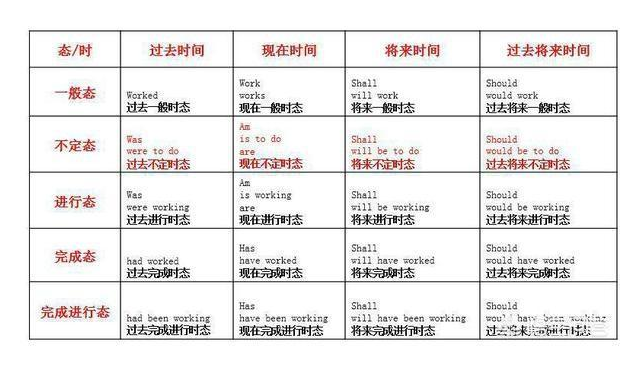

## English
### 时态表


### 句子成分

- 句子成分的定义： 构成句子的各个部分叫做句子成分。句子成分有主要成分和次要成分；
- 主要成分有主语和谓语；次要成分有表语、宾语、定语、状语、补足语和同位语

### 句子成分表


#### 主语： 

- 主语 (Subject)     是一个句子所叙述的主体，一般位于句首。
- 但在there be结构、疑问句（当主语不是疑问词时）和倒装句中，主语位于谓语、助动词或情态动词后面。
- 主语可由名词、代词、数词、不定式、动名词、名词化的形容词和主语从句等表示。

```English
例如： 
1.During the 1990s, American country music has become more and more popular. 名词 
2.We often speak English in class. 代词 3.One-third of the students in this class are girls.数词 
4.To swim in the river is a great pleasure.不定式 
5.Smoking does harm to the health. 动名词 
6.The rich should help the poor. 名词 
7.When we are going to have an English test has not been decided. 主从 
8.It is necessary to master a foreign language.形式主语
```

#### 谓语 (Predicate)

- 说明主语所做的动作或具有的特征和状态。
- 动词在句中作谓语，一般放在主语之后。谓语的构成如下： 
- - 1、简单谓语：由一个动词或动词短语构成。如： He practices running every morning. The plane took off at ten o’clock. 
  - 2、复合谓语： 
  - - （1）由情态动词或其他助动词加动词原形构成。如： You may keep the book for two weeks.  He has caught a bad cold.  
  - - （2）由系动词加表语构成。如：We are students. 注意：谓语与主语在人称与数方面要保持一致。

#### 表语(Predicative)

- 用以说明主语的性质、特征、状态与身份，它一般位于系动词( 如be, become, get, look, grow, turn, seem等 )之后

- 表语一般由名词、代词、形容词、数词、 副词、不定式、动名词、分词、介词短语及表语从句表示。

  ```English
  例如：  
  1.Our teacher of English is an American. （名词） 
  2.Is it yours?（代词） 3.The weather has turned cold.（形容词） 
  4.The speech is exciting.（分词） 
  5.Three times seven is twenty one?（数词） 
  6.His job is to teach English.（不定式） 7.His hobby is playing football.（动名词）
  8.The meeting is of great importance.（介词短语）注：of+名词结构=形容词 9.Time is up. The class is over.（副词） 
  10.The truth is that he has never been abroad.（表语从句） 
  ```

  - 注意：系动词（Linking verb)用于连接主语和表语，说明主语的状态，性质特征和身份等。

  

- 状态系动词  用来表示主语状态，只有be一词，

- - 例如： He is a teacher. 

- 连续性动词  用来表示主语继续或保持一种状况或态度，主要有keep, rest, remain, stay, lie, stand, 

- - 例如： He always kept silent at meeting.  

- 表像系动词  用来表示“看起来像”这一概念，主要有seem, appear, look, 

- - 例如： He seems (to be) very sad.   

- 感官系动词主要有feel, smell, sound, taste,

- - 例如： This kind of cloth feels very soft.  

- 变化系动词  表示主语变成什么样，主要有become, grow, turn, fall, get, go, come, run.

- - 例如： He became mad after that

- 终止系动词  表示主语已终止动作，主要有prove, turn out, 表达"证实"，"变成"之意，

- - 例如： The rumor proved false.  His plan turned out a success 

### 宾语（Object）

- 表示动作的对象或承爱者，一般位于及物动词和介词后面。

```English
例如：  
1.They went to see an exhibition yesterday.名词 
2.The heavy rain prevented me from coming to school on time.代词，动词 
3.How many dictionaries do you have? I have five.名词，数词 
4.They helped the old with their housework yesterday.名词化形容词，名词 
5.He pretended not to see me.不定式短语 
6.I enjoy listening to popular music.动名词短语 
7.I think（that）he is fit for his office.宾语从句 

```

#### 宾语种类： 

- 双宾语（间接宾语+直接宾语），

```English
例如：Lend me your dictionary, please. To: write, tell, pass, give, send, promise, show, hand, read, tell, bring, throw等，
例如： He sent the novel to William yesterday. For: leave, buy, build, choose, cook, draw, find, get, order, post, save等，
例如： She bought a gift for her mother. 
```


#### 复合宾语（宾语+宾补），

```English
如： 1. They elected him their monitor. 下列动词只能接不定式做宾语 ---
	 ask, agree, care, choose, demand, dare,decide, expect, fail, help, hope, learn, manage, 	      offer, plan, prepare, pretend, promise, refuse, want, wish, desire等 
	3. He refused to lend me his bike. 下列动词只能接动名词做宾语 --- 
	admit, avoid, advise, consider, enjoy, excuse, escape, finish, imagine, mind, practise, suggest等， ---
	：John has admitted breaking the window 下列动词既可接不定式，也可接动名词做宾语，但意义不同--
	 stop, mean, try, remember, forget, regret等。 
	 to do doing stop 停下去做 停下正在做的某事 
	 mean 打算去做 意味着 
	 try 尽力去做 尝试做 
	 remember 记得去做 记得做过 
	 forget 忘记去做 忘记做过 
	 regret 内疚去做（还没做） 内疚去做（已经做过）
```
#### 宾语补足语

- 英语中有些及物动词，除有一个直接宾语以外，还要有一个宾语补足语（Object Complement），才能使句子的意义完整
- 带有宾语补足语的一般句型为：某些及物动词（如make等)+宾语+宾补）
- 宾补可由名词、形容词、副词、不定式、分词、介词短语和从句充当

```English
例如：  
    1.His father named him Dongming.名词 
    2.They painted their boat white.形容词 
    3.Let the fresh air in.副词 
    4.You mustn’t force him to lend his money to you.不定式短语 
    5.We saw her entering the room.现在分词 
    6.We found everything in the lab in good order.介词短语 
    7.We will soon make our city what your city is now.从句 
```

###  定语  

- 修饰名词或代词的词、短语或从句称为定语(Attribute)

- 定语可由以下等成分表示： 

  ```English
  1.Guilin is a beautiful city.（形容词） 
  2.China is a developing country; America is a developed country.（分词）  
  3.There are thirty women teachers in our school.（名词） 
  4.His rapid progress in English made us surprised.（代词） 
  5.Our monitor is always the first to enter the classroom.（不定式短语） 
  6.The teaching plan for next term has been worked out.（动名词） 
  7.He is reading an article about how to learn English.（介词短语） 
  8.Farmers who saw us stared at us as if we are walking skeletons. (定语从句) 
  ```

  
###  状语

-  修饰动词、形容词、副词或整个句子，说明动作或状态特征的句子成分，叫做状语（Adverbial）
-  可由以下形式表示 ： 

```
1.Light travels most quickly.（副词及副词性词组） 
2.He has lived in the city for ten years. （介词短语） 
3.He is proud to have passed the national college entrance examination.（不定式短语） 
4.He is in the room making a model plane.（分词短语） 
5.Wait a minute.（名词） 
6.Once you begin, you must continue.（状语从句） 
```

- 9种状语种类如下： 

```English
1. How about meeting again at six?（时间状语） 
2.Last night she didn’t go to the dance party because of the rain.（原因状语） 
3.I shall go there if it doesn’t rain. （条件状语） 
4.Mr Smith lives on the third floor. （地点状语） 
5.She put the eggs into the basket with great care.（方式状语） 
	She came in with a dictionary in her hand.（伴随状语） 
6.In order to catch up with the others, I must work harder. （目的状语） 
7.He was so tired that he fell asleep immediately. （结果状语） 
8.She works very hard though she is old.（让步状语） 
9.I am taller than he is.（比较状语） 
```


### 同位语（Appositive）

- 对前面的名词或代词做进一步的解释，通常由名词、数词、代词或从句担任，
- 如： This is Mr. Zhou, our headmaster.  

### 插入语（Parenthesis）

- 对一句话做一些附加的解释，通常有   to be honest , I think (suppose, believe---)等
- 如： To be frank, I don’t quite agree with you. 

