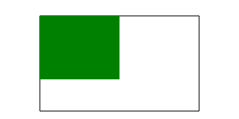

## canvas
[TOC]
### 序言
- 在渲染复杂的特效,把数据可视化图形显示,游戏场景等需求,都运用canvas
- 比dom操作性能更高
### 特点
- H5新增的图形标签,通过提供的JavaScript的函数绘制各种图表,或利用算法实际非常华丽的功效
- 在以前是用Flash技术型,但不能和JS交互
- 适合动态图形绘制
### 缺点
- 是位图,缩放会模糊
### canvas标签
- 默认(`300×150`)px
- 如果不在标签内添加width和height属性,那么在绘图时,它们的宽高都是以css样式里的宽高成比例`(倍数)`出现的
- 从边框的中间开始绘制,而不是从边框内部或外部开始绘制的
### canvas API
- 绘制目前只有2d环境

		var oCan = document.querySelector("canvas");
		var c = oCan.getContent("2d"); //2d必须小写

- 绘制矩形 : 

	   c.rect(x,y,w,h);

- 绘制填充实心矩形 : 

    c.fillRect(x,y,w,h);

- 空心矩形: 

    c.strokeRect(x,y,w,h);

- 清除矩形选区: 

    c.clearRect(x,y,w,h);

- 边框大小
- - 最小是2px,而不是0px(即使设置的0px)
- - 如果是小数,那么会四舍五入,不会显示小数值,太小不会显示
- - 向左向右延伸,所以会延伸都会是设置边框`+1px`
- - 可能设置边框的宽度没什么作用

    c.lineWidth  = x;//x是任何大于0的数

**从X=?,Y=?处开始绘制,`而w,h是大小`**
***从边框的中间向两边开始绘制* `(中间)`**

- `绘制方式`
- - 以边框线的方式绘制图形,默认填充黑色

    c.stroke();

- - 以填充的方式绘制图形,默认填充黑色

    c.fill();

### 绘制样式属性
- c.fillStyle    填充颜色
- c.strokeStyle    触笔颜色
- lineWidth     触笔粗细(线宽)
### 绘制线条
- 起始点

    c.moveTo(x,y);//从x,y开始

- 绘制到x,y

    lineTo(x,y);

- 特点

    在x为x.5时,可以使线框宽为1,否则为2,为了不产生干扰,都会使用图形路径

#### 图形路径
- 开始路径

	c.beginPath();

- 结束路径

    c.closePath();

- 特点

    使首尾不连接,不会产生干扰
    ///////
    特点: 就是不让前一个路径与后一个路径有影响,在实际使用过程中,都会写上beginPath() ,不写会出现问题

#### 边界连接点样式
- loneJoin  起点样式

    c.lineJoin = " miter ";
    // miter 默认值     round 圆角        bevel    斜角

- lineCap    端点样式

    c.lineCap = " butt " 
    // butt    默认样式      round     圆角     square    高度多出线宽一半(会变长  高度/2)

### arc
#### 三角函数
- `1 rad = (180°/π)*α`
- rad = `α*Math.PI( )/180°`

#### 绘制圆形

    c.arc(x,y,r,0,360,false);
    // r 半径        0,360是弧度范围     true是逆时针
    // false 是顺时针

### 绘制文字
[参考链接](https://blog.csdn.net/sinat_25127047)
- c.font = " " ;

    font属性可以像css里font那样设置

- c.fillText(string,x,y,[maxlen]);

    string 文字内容,    (x,y)表示坐标        [maxlen]可选,表示绘制这段文字的最长的宽度
   
- 水平对齐

    c.textAlign = " start center end  left right";

- 垂直对齐

    c.textBaseLine = "top middle hanging bottom ideographic";
    alphabetic			默认。文本基线是普通的字母基线
	top					文本基线是 em 方框的顶端
	hanging				文本基线是悬挂基线
	middle				文本基线是 em 方框的正中
	ideographic			文本基线是表意基线。
	bottom				文本基线是 em 方框的底端。

- 字体颜色

    c.fillStyle = " " 
- 获取到文本的实际宽度

    cxt.measrue(str).widht;//没有宽度
    把获取到的宽度给用在obj.fillStyle()和obj.stroke()上就可以是文字在画布内居中

- 记得把这两个首尾加上
- 可以使其内成为一个独立的作用域
- 不会继承属性了
- [参考链接](https://www.w3cplus.com/canvas/canvas-states.html)

	cxt.save();//保存路径
    cxt.restore();//恢复路径

### 阴影
- 阴影的三个属性(`缺一不可`):

    shadowOffsetX,shadowOffsetY  =   number ;
    //x轴和y轴的偏移量
    shadowBlur  =   number  阴影的模糊度
    shadowColor =   string  阴影的颜色
    默认颜色   : rgba( 0,0,0,1);

### 重新定义坐标基点(0,0)及继承

    c.translate(x,y);

- 都有默认有继承性,会继承上面的的属性

### 裁剪`(clip)`
[参考链接](http://www.w3school.com.cn/tags/canvas_clip.asp)
- 从画布中剪切 `200*120` 像素的矩形区域。然后，绘制绿色矩形。只有被剪切区域内的绿色矩形部分是可见的：
- 

    var c=document.getElementById("myCanvas");
	var ctx=c.getContext("2d");
	// 剪切矩形区域
	ctx.rect(50,20,200,120);
	ctx.stroke();
	ctx.clip();
	// 在 clip() 之后绘制绿色矩形
	ctx.fillStyle="green";
	ctx.fillRect(0,0,150,100);

- clip() 方法从原始画布中剪切任意形状和尺寸

**提示：**一旦剪切了某个区域，则所有之后的绘图都会被限制在被剪切的区域内（不能访问画布上的其他区域）。
`您也可以在使用 clip() 方法前通过使用 save() 方法对当前画布区域进行保存，并在以后的任意时间对其进行恢复（通过 restore() 方法）`
### 旋转

    c.rotate(α*Math.PI/180);

### 缩小与放大

    c.scale(x,x);//大于1放大,小于1缩小

- 必须写两个值
- 只会改变画布内的图形
- `同样会继承`
- 有顺序的区别,写的位置会影响效果

### 绘制图片

    window.onload = function(){
        var cxt = document.querySelector("canvas").getContext("2d"),
            cxtU =document.querySelector("canvas");
        var img = new Image();
        img.src = "images/1.jpg";
        //绘制图片
        img.onload = function(){
            cxt.drawImage(img,0,0,300,400);
        };
        //下载图片    需要服务器的支持
        //不需要绘制2d,否则报错
        document.onclick = function(){
            var url = cxtU.toDataURL("image/jpeg");
            var a = document.createElement("a");
            a.href = url;
            a.download = "xiazai1.jpg";
            a.click();
        }
    }

- c.drawImage( `image,x,y,w,h` );
- - 火狐下要用onload事件,谷歌不用,但是可以都写上,这样就都可以用了
### 图片裁剪

    c.drawImage(image,x1,y1,w1,h1,x2,y2,w2,h2);
    // x1,y1   img图片上的x,y坐标
    // w1,h1   剪切宽高
    // x2,y2   canvas上的x,y坐标
    // w2,h2   指定剪切区域的宽高

### 图片下载
- 需要服务器的支持

    cxtU.toDataURL( );//默认导出data:png;base64编码的二进制URL
    cxtU.toDataURL("image/jpeg ");//导出data:jpg;base64编码的二进制URL
    //用a标签下载

- 也同样适用于video标签
- 但是要用`requestAnimationFrame(function)`;
- 如上

### 设置填充背景

    var cxt = document.querySelector("canvas").getContext("2d");
      var img = new Image();
      img.src = "images/18.jpg";
      img.onload = function () {
          var bg = cxt.createPattern(img,"repeat");
          cxt.fillStyle = bg;
          //这里要超过图片的大小才会看到平铺效果,而才会去看canvas大小来决定平铺效果,否则看不到效果
          cxt.fillRect(0,0,2000,2000);
      }

- 创建填充背景

    var bg = cxt.createPattern(img,"平铺方式");
    //平铺方式有  : repeat   repeat-x    repeat-y   
    //no-repeat

- 使用`cxt.fillStyle = bg`和`cxt.fillRect(x,y,w,h)`;来绘制效果

    x,y是坐标
    w,h来决定准备填充背景的大小是多少,小于图片的大小,看不到效果

###  颜色渐变
- 线性渐变

    var cxt = document.querySelector("canvas").getContext("2d");
    var color = cxt.createLinearGradient(0,0,500,500);
    //位置的顺序不会随着代码的书写顺序改变而该变
    //只和位置的值有关
    color.addColorStop(0.1,"#ff0027");
    color.addColorStop(0.2,"#444");
    color.addColorStop(0.4,"#7ed461");
    color.addColorStop(0.7,"#d4a04a");
    color.addColorStop(0.9,"#3dd454");
    cxt.fillStyle = color;
    cxt.fillRect(0,0,500,500);//位置会受w,h的影响,有可能不会全部的显示出来效果

- cxt.createLinearGradient(  x1,y1,x2,y2 );

    x1,y1    起始坐标点
    x2,y2    结束坐标点

- 添加颜色

    obj.addColorStop( 位置,"颜色");
    // 颜色可以是    十六进制     英文名     rgb   rgba的

- 径向渐变

    var cxt = document.querySelector("canvas").getContext("2d");
	var color = cxt.createRadialGradient(250,250,1,250,250,10);
    color.addColorStop(0,'rgba(255,255,255,0.8)');
    color.addColorStop(0.3,'rgba(0,0,0,0)');
    color.addColorStop(0.6,'rgba(0,0,0,0)');
    color.addColorStop(1,'rgba(255,255,255,0.05)');
    cxt.fillStyle = color;
    cxt.arc(250,250,10,0,6.3);
    cxt.fill();

- c.createRadialGradient(x1,y1,r1,x2,y2,r2);

    x1,y1,r1       内圆的坐标及半径
    x2,y2,r2       外圆的坐标及半径

### 绘制曲线
- cxt.arcTo( x1,y1,x2,y2,r);`一次`
- - x1,y1  坐标 一    `x2,y2   坐标二 `     r圆弧`半径`

    var cxt = document.querySelector("canvas").getContext("2d");
    cxt.moveTo(100,100);
    cxt.arcTo(100,300,250,250,50);
    cxt.stroke();

- x1`≠`y1,否则`可能`看不到效果

- cxt.quadraticCurveTo( dx,dy,x,y);`二次`
- - 贝塞尔曲线     dx,dy控制点     x,y结束坐标

    var cxt = document.querySelector("canvas").getContext("2d");
    cxt.moveTo(180,50);
    cxt.quadraticCurveTo(0,200,180,300);
    cxt.stroke();

- cxt.bezierCurveTo(dx1,dy1,dx2,dy2,x,y); `三次`
- - dx1,dy2 `控制点一 `     `dx2,dx2控制点二`           `x,y结束坐标`

    var cxt = document.querySelector("canvas").getContext("2d");
    cxt.moveTo(180,58);
    cxt.bezierCurveTo(10,150,255,200,180,400);
    cxt.stroke();

- 记住,所设置的坐标或者是控制点的坐标都是canvas的实际坐标
- 坐标都在弧顶那儿拉

### 像素操作

    var cxt = document.querySelector("canvas").getContext("2d");
    //创建
    var imgData = cxt.createImageData(100,100);
    //随机生成颜色
    for ( var i = 0; i < imgData.data.length; i += 4 ) {
       imgData.data[i+0] = Math.floor(Math.random()*256);
       imgData.data[i+1] = Math.floor(Math.random()*256);
       imgData.data[i+2] = Math.floor(Math.random()*256);
       imgData.data[i+3] = Math.floor(Math.random()*256);
    }
    cxt.putImageData(imgData,250,200);
   
   - cxt.createImageData(sx,sy);
   

    面积  : sx × sy
    1个像素是由4个像素点组成的
    rgba( );0-255
    数据长度 : sx × sy × 4      

- 这个有点缺点     就是如果用for循环处理数据,那么性能不太好
- 如果要彻底解决这个问题,那可以使用`多线程`
- 获取

    var cxt = document.querySelector("canvas").getContext("2d");
    var img = new Image();
    img.src = "images/18.jpg";
    img.onload = function () {
        cxt.drawImage(img,300,300,300,300);
        var imgData = cxt.getImageData(300,300,300,300);
        for (var i = 0; i < imgData.data.length; i += 4) {
            imgData.data[(i+0)*8] = Math.floor(Math.random()*256);
            imgData.data[(i+1)*8] = Math.floor(Math.random()*256);
            imgData.data[(i+2)*8] = Math.floor(Math.random()*256);
            imgData.data[(i+3)*8] = 255;
        }
        cxt.putImageData(imgData,0,0);
    }

- 如果看不效果,请先对比,就可以看到

	   cxt.getImageData(x1,y1,w,h);
	   x1,y1  位置      w,h  大小          //获取某一个区域的

### 合成
- globalAlpha      设置或返回绘图当前的alpha或透明值
- globalComPositeOperation  设置或返回新图像如何绘制到已有的图像上

    cxt.globalCompositeOperation = " " ;
    ↓↓↓↓↓↓↓↓↓↓↓↓↓↓↓↓↓↓↓↓↓↓↓↓↓↓↓↓↓↓↓
    source-over		默认。在目标图像上显示源图像。
	source-atop		在目标图像顶部显示源图像。源图像位于目标图像之外的部分是不可见的。
	source-in		在目标图像中显示源图像。只有目标图像内的源图像部分会显示，目标图像是透明的。
	source-out		在目标图像之外显示源图像。只会显示目标图像之外源图像部分，目标图像是透明的。
	destination-over	在源图像上方显示目标图像。
	destination-atop	在源图像顶部显示目标图像。源图像之外的目标图像部分不会被显示。
	destination-in		在源图像中显示目标图像。只有源图像内的目标图像部分会被显示，源图像是透明的。
	destination-out		在源图像外显示目标图像。只有源图像外的目标图像部分会被显示，源图像是透明的。
	lighter				显示源图像 + 目标图像。
	copy				显示源图像。忽略目标图像。
	xor					使用异或操作对源图像与目标图像进行组合。

