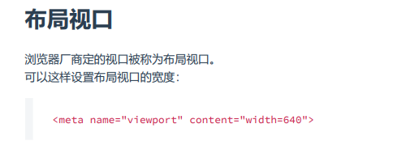
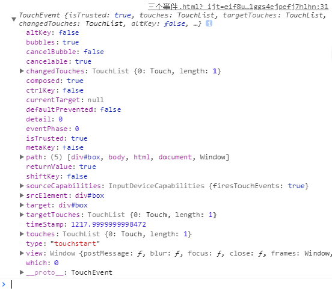
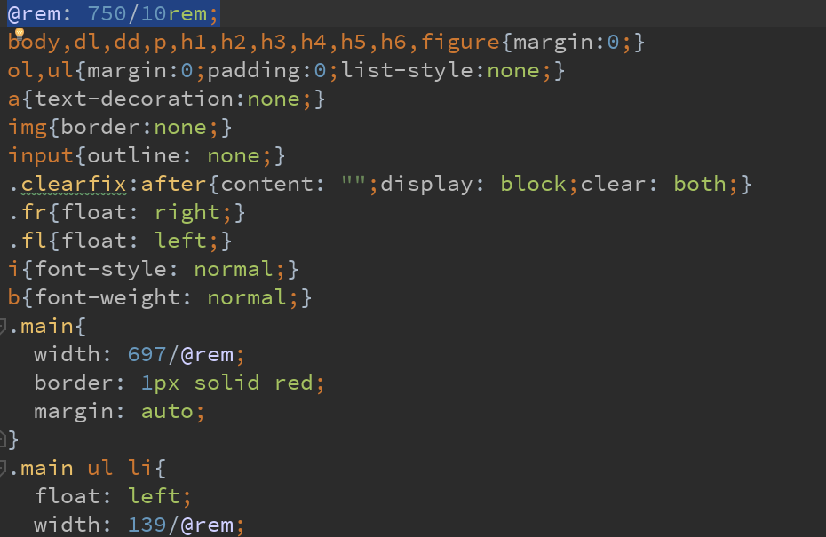

# 移动端及适配
### 移动端的触屏事件
#### ontouchstart
- 手指按下触发
- 相当于`onmousedown/onclick`
#### ontouchmove
- 手指移动触发
- 相当于` onmousemove`
#### ontouchend
- 手指抬起触发
- 相当于`onmouseup`

    三个都兼容所有平台(安卓和iOS)

### 视口

- 视口的作用：`在移动浏览器中，当页面宽度超出设备，浏览器内部虚拟的一个页面容器，将页面容器缩放到设备这么大，然后展示`
- 属性

    //宽度等于设备宽度device-width pixel_value具体数值
    //直接设置具体数值大部分的安卓手机是不支持的 但是IOS支持
    width		[pixel_value | device-width] 
	height 		[pixel_value | device-height]
	initial-scale 		初始比例
	minimum-scale 	允许缩放的最小比例
	maximum-scale 	允许缩放的最大比例 
	user-scalable 	是否允许缩放 （yes || no 或 1 | 0）
	target-densitydpi [dpi_value | device-dpi | high-dpi | medium-dpi | low-dpi]

- 理想视口

    <meta name="viewport" content="width=device-width">
    
- 完美视口

    <meta name="viewport" content="width=device-width,initial-scale=1">

**注:`一部分的PC端事件是可以在移动端上使用的`**
**iOS和安卓的浏览器表现可能会很大**
###   阻止默认事件和冒泡
#### 方法
- 默认事件

    e.preventdefault()

- 阻止冒泡

    e.stopPropagation();

#### 付出的代价
- 滚动条失效
- 不可以选择`(文字)`复制
- 且解决iOS在有网页会网页回弹的橡皮筋的现象

### 事件点透
#### 事件点透的产生
- 1.PC端鼠标事件在移动端也可以正常使用,事件的执行会有300ms的延迟
- 2.问题的产生是点击页面之后,浏览器会让记录点击下去的坐标
- 3.300ms值,在坐标知道现在的元素,执行该事件

#### 事件点透的解决方法
1. `阻止默认事件,但在部分安卓上不支持`
2. 不用a标签做页面跳转,`使用它: `

    window.location.href = "http "; 

3. `在移动端不用鼠标事件`

### 手指对象
- TouchEvent
- `可以用判断length来实现手指操作`
- 安卓要自己封装手指功能
- 而iOS下有多指事件
- - 在ontouchend事件下打印e

    

- - 结果如下

- 触发当前的事件的列表

    e.changedTouch[0]
    e.targetTuches    (手指抬起就消失)
    //手指抬起了,也就没有了touches.targetTouches了
    只能用changedTouches

### 获取坐标
- e.changedTouches[0].pageX/Y;

    pageX/Y根据(坐标去实现移动端实现的交互效果

### 防误触
- 用JS做判断,手指移动就`不跳转`,没有移动说明是`点击就跳转`了

## 适配
### 为什么要适配: 
- 为了适应各种移动端设备完美呈现布局的效果
- 各种移动端设备分辨率大小不一致,网页想铺满整个屏幕,不在各种分辨率下等比例缩放
### 适配方案
- 固定高度         宽度自适应(百分比)

    表示元素的大小
        宽度 0%-100% flex 不固定
        高度 固定px em  由内容（文字 、img[width='100%']）
        JD TX BD TM YMX
	//使用了完美视口
	<meta name="viewport" content="width=device-width,initial-scale=1">
	//这样设置之后，我们就可以不用管手机屏幕的尺寸进行开发了。

- 固定宽度         viewport缩放【自适应】 灵活性不强

	用起来比较方便，跟PC端布局基本一样，【自适应】 不管在任何设备下，布局的风格一模一样
        相对而言用的比较少
        ＬＺ　ＷＹｎｅｗｓ
        表示元素的大小
        pX % flex
        //代码示例
       

- rem做宽度      viewport缩放   `可以较好的展示和渲染页面`

    表示元素的大小
        rem flex %
        目前用得比较普遍，在不同的屏幕下，元素的大小都不同
        根据 浏览器的屏幕宽度去进行适配（等比例缩放）
        r    root -> html标签
        em   根据自身的文字大小去计算  默认文字大小是16px 那 1em = 16px
        rem 根据html元素的文字大小，去计算元素的大小
        需要用到less

- 代码示例

    
    //在less中声明
    @rem: 750/10rem;
    其他就和写css文件一样

- media     判断屏幕宽度,设置HTML的文字大小
- - 1vm 1vh     整个屏幕`宽/高`度1%

