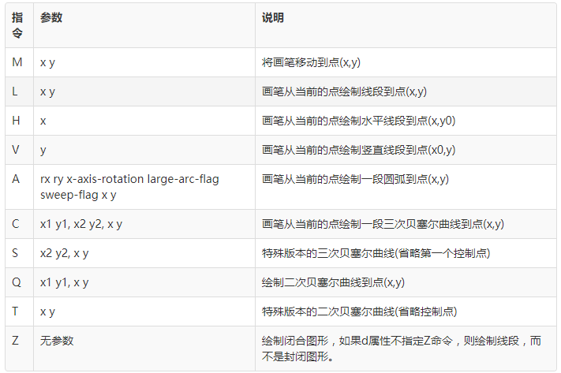
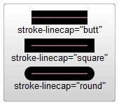
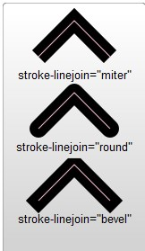
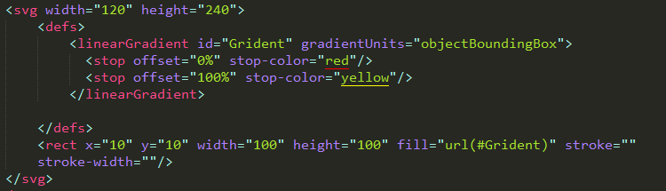
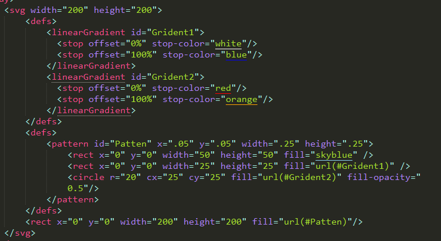
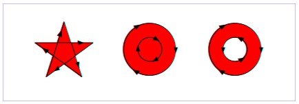
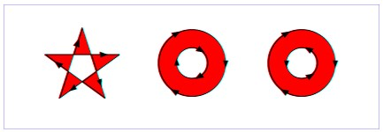
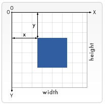
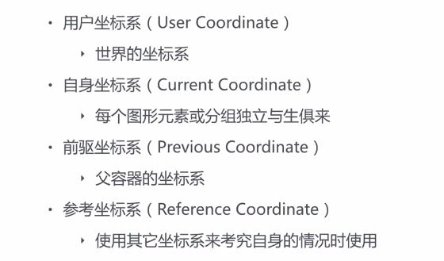

## SVG
[TOC]
### 特点

    HTML体系中，最常用的绘制矢量图的技术是SVG和HTML5新增加的canvas元素。这两种技术都支持绘制矢量图和光栅图。不过canvas更偏重于动画的制作。所以，绘制矢量图的大任落到了SVG身上。

### 简介
- 可缩放矢量图形(Scalable Vector Graphics，简称SVG)是一种使用XML来描述二维图形的语言(SVG严格遵从XML语法)。 SVG允许三种类型的图形对象：矢量图形形状（例如由直线和曲线组成的路径）、图像和文本。 可以将图形对象（包括文本）分组、样式化、转换和组合到以前呈现的对象中。 SVG 功能集包括嵌套转换、剪切路径、alpha 蒙板和模板对象。

- SVG既可以说是一种协议，也可以说是一门语言；既是HTML的一个标准元素，也是一种图片格式。

#### SVG与其他的图片格式对比
- SVG与其它的图片格式相比，有很多优点(`很多优点来源于矢量图的优点`)：

- SVG文件是纯粹的XML， 可被非常多的工具读取和修改(比如记事本)。
- SVG的元素和属性必须按标准格式书写，因为XML是区分大小写的（这一点和html不同）
- SVG里的属性值必须用引号引起来，就算是数值也必须这样做。
- SVG 与JPEG 和GIF图像比起来，尺寸更小，且可压缩性更强。
- SVG 是可伸缩的，可在图像质量不下降的情况下被放大，可在任何的分辨率下被高质量地打印。
- SVG 图像中的文本是可选的，同时也是可搜索的(很适合制作地图)。
- SVG 可以与 Java 技术一起运行。
- SVG 是开放的标准。
- **`注意事项`**： 

    SVG的元素和属性必须按标准格式书写，因为XML是区分大小写的（这一点和html不同） 
    SVG里的属性值必须用引号引起来，就算是数值也必须这样做。

### SVG使用方式

    可以直接使用svg
    可以使用img标签引用svg
    可以在HTML中使用svg
    可以作为背景图片
    使用SVG画图

### SVG画图标签及特点
#### 矩形 - rect元素

    <rect x="10" y="10" width="30" height="30"/>
    <rect x="60" y="10" rx="10" ry="10" width="30" height="30"/>

- 这个元素有6个控制位置和形状的属性，分别是：
- x：矩形左上角的坐标(用户坐标系)的x值。
- y：矩形左上角的坐标(用户坐标系)的y值。
- width：矩形宽度。
- height：矩形高度。
- rx：实现圆角效果时，圆角沿x轴的半径。
- ry：实现圆角效果时，圆角沿y轴的半径。
- stroke-opacity = " "和fill-opacity = " " ;`都是透明度`
- **注意**：rx与ry只设置了一个，另一个值等于设置了的这个值
#### 圆 - circle元素

    <circle cx="25" cy="75" r="20"/>

- 这个元素的属性很简单，主要是定义圆心和半径：
- r：圆的半径。
- cx：圆心坐标x值。
- cy：圆心坐标y值。
#### 椭圆 - ellipse元素

    <ellipse cx="75" cy="75" rx="20" ry="5"/>

- 这个是更加通用的圆形元素，你可以分别控制半长轴和半短轴的长度，来实现不同的椭圆，很容易想到，当两个半轴相等时，就是正圆形了。
- rx：半长轴(x半径)。
- ry：半短轴(y半径)。
- cx：圆心坐标x值。
- cy：圆心坐标y值。
#### 直线 - line元素

    <line x1="10" x2="50" y1="110" y2="150"/>
- 直线需要定义起点与终点即可：
- x1：起点x坐标。
- y1：起点y坐标。
- x2：终点x坐标。
- y2：终点y坐标。
- 如果是写了多线段连接,那么在端点连接处可能处理的不太好
#### 折线 - polyline元素

    <polyline points="60 110, 65 120, 70 115, 75 130, 80 125, 85 140, 90 135, 95 150, 100 145"/>
- 折线主要是要定义每条线段的端点即可，所以只需要一个点的集合作为参数：
points：一系列的用空格，逗号，换行符等分隔开的点。每个点必须有2个数字：x值和y值。所以下面3个点 (0,0), (1,1)和(2,2)可以写成：”0 0, 1 1, 2 2”。
- 可以用空格、逗号一起或`单独使用`,可以用来分组

#### 多边形- polygon元素

    <polygon points="50 160, 55 180, 70 180, 60 190, 65 205, 50 195, 35 205, 40 190, 30 180, 45 180"/>

- 这个元素就是比polyline元素多做一步，把最后一个点和第一个点连起来，形成闭合图形。参数是一样的,**`在端点处连接处理的很好`**
- points：一系列的用空格，逗号，换行符等分隔开的点。每个点必须有2个数字：x值和y值。所以下面3个点 (0,0), (1,1)和(2,2)可以写成：”0 0, 1 1, 2 2”。路径绘制完后闭合图形，所以最终的直线将从位置(2,2)连接到位置(0,0)。
- `fill-rule:` evenodd/nonzero `中空/默认`
- **不可以单独改变某一条线的颜色**

#### 路径 - path元素

```
<path d="M 20 230 Q 40 205, 50 230 T 90230"/>
```

- 这个是最通用，最强力的元素了；使用这个元素你可以实现任何其他的图形，不仅包括上面这些基本形状，也可以实现像贝塞尔曲线那样的复杂形状；
- 使用path可以实现**平滑的过渡线段**，虽然也可以使用`polyline`来实现这种效果，但是需要提供的点很多，而且放大了效果也不好。
- 这个元素控制位置和形状的只有一个参数：

##### d：一系列绘制指令和绘制参数(点)组合成。

- 中间的字母的意思：

```
1. M：moveTo M10 10
2. L：lineTo L10 10
3. H：H draws a horizontal line H 90
4. V：V draws a vertical line V 90
5. Z：ClosePath Z
6. C：三次贝赛尔曲线 C x1 y1, x2 y2, x y
7. S：三次贝赛尔曲线补充命令。S命令可以用来创建与之前那些曲线一样的贝塞尔曲线但是，如果S命令跟在一个C命令或者另一个S命令的后面，它的第一个控制点，就会被假设成前一个控制点的对称点。如果S命令单独使用，前面没有C命令或者另一个S命令，那么它的两个控制点就会被假设为同一个点。S x2 y2, x y
8. Q：二次贝塞尔曲线 **Q x1 y1, x y**
9. T：二次贝赛尔曲线补充命令。与S有异曲同工之妙。T命令前面必须是一个Q命令，或者是另一个T命令，才能达到这种效果。需要注意的是，如果T单独使用，那么控制点就会被认为和终点是同一个点，所以画出来的将是一条直线。 T x y
10. A：弧形命令 A rx ry x-axis-rotation large-arc-flag sweep-flag x y 前两个参数分别是x轴半径和y轴半径，第三个参数表示弧形的旋转情况。large-arc-flag（角度大小） 和sweep-flag（弧线方向），large-arc-flag决定弧线是大于还是小于180度，0表示小角度弧，1表示大角度弧。sweep-flag表示弧线的方向，0表示从起点到终点沿逆时针画弧，1表示从起点到终点沿顺时针画弧。最后两个参数是指定弧形的终点
```

- - **L,H,V为小写的时候便表示的是长度，为大写的表示的是坐标**

```
绘制指令分为绝对坐标指令和相对坐标指令两种，这两种指令使用的字母是一样的，就是大小写不一样，绝对指令使用大写字母，坐标也是绝对坐标；相对指令使用对应的小写字母，点的坐标表示的都是偏移量。
```

#### 绝对坐标绘制指令
- 这组指令的参数代表的是绝对坐标。假设当前画笔所在的位置为(x0,y0)，则下面的绝对坐标指令代表的含义如下所示：


- **边框色 - stroke属性**
- - 设置的值画图形的边框，使用起来也很直接，把颜色值赋给它就可以了。
**注意：**

    默认不会绘制图形边框,但是会填充(fill="none")
    设置透明度:
	    stroke-opacity: (0-1);
	设置描边
		stroke-width: ;

- **线的端点 - stroke-linecap属性** 
- - 定义了线段端点的风格


	可以使用的三个值
    butt,square,round

- **线的连接 - stroke-linejoin属性** 
- - 线段连接处的风格


    可以使用的三个值,和canvas一样
    miter,round,bevel
- **线的虚实 - stroke-dasharray属性** 
- - 设置线段采用何种虚实线。

```
这个属性是设置一些列数字，不过这些数字必须是逗号隔开的。
属性中包含空格，但是空格不作为分隔符。
每个数字定义了实线段的长度,分别是按照绘制,不绘制这个顺序循环下去。
需要注意两个值与三个值的情况
```

- **stroke-miterlimit** 
- - 这个和canvas中的一样，它处理什么时候画和不画线连接处的miter效果。

- **stroke-dashoffset** 
- - 这个属性设置开始画虚线的位置。

#### SVG颜色的表示
##### 特点:
> SVG和canvas中是一样的，都是使用标准的HTML/CSS中的颜色表示方法，这些颜色都可以用于fill和stroke属性。

##### 定义颜色的方式

> 可以使用`英文名称,rgba,十六进制` 

##### 渐变

```
使用linearGradient元素即可定义线性渐变，每一个渐变色成分使用stop元素定义。
x1=”0” x2=”0” y1=”0” y2=”1”：四个属性决定渐变的方向
```


- **注意：**
> 1. 使用stop定义
> 1. 渐变代码需要放在<defs>标签中
> 1. 必须使用id命名
> 1. 使用url(#id)赋值
> 1. offset属性：这个和线性渐变的值是一样，但是含义不一样。在环形渐变中，**0%代表圆心处**

- 线性渐变
> 线性：**linearGradient**
> 

- 径向：**radialGradient**
> 1. **cx,cy,r属性**：其实也很好理解，环形渐变，当然要定义环的圆心和半径了，体会一下上面例子中圆的大小和位置就能理解了。
> 1. **fx,fy属性**：定义颜色中心(焦点)处的位置，也就是渐变色最浓处的坐标
> 1. 不过这里需要注意一下上面cx,cy,r,fx,fy的值，你会发现它们都是小数，那么单位是什么呢？

> 1. 这个需要先了解另外一个相关的属性：**gradientUnits**，它定义了定义渐变色使用的**坐标单位**。这个属性有2个可用值：**`userSpaceOnUse`和`objectBoundingBox`**

> + objectBoundingBox是默认值，它使用的坐标都是相对于对象包围盒的(方形包围盒，不是方形包围盒的情况比较复杂)，**取值范围是0到1**。
> + 例如上例中的cx,cy的坐标值(**0.25,0.25**)。意味着这个圆心是在包围盒的左上角1/4处，半径0.25意味着半径长是对象方形包围盒长的1/4，就像你们图中看到的那样。

> + **userSpaceOnUse**表示使用的是`绝对坐标`，使用这个设置的时候，你必须要保证**渐变色和填充的对象要保持在一个位置**。

 - spreadMethod属性：
> 1. 这个属性定义了渐变色到达它的终点时应该采取的行为。
> 2. 该属性有**3个可选值**：pad(默认值),reflect,repeat。
> 3. **pad属于自然过渡**，渐变色结束以后，使用最后一个成员色直接渲染对象剩下的部分。
> 4. **refect会让渐变色继续**
> + 渐变色会反向继续渲染，从最后一个颜色开始到第一个颜色这个顺序渲染；
> + 等到**再次到达渐变色**终点时,**再反序**,如此这般指导对象填充完毕
> + **repeat也会让渐变色继续渲染**，但是`不会`反序，还是一遍一遍`从第一种颜色到最后一种颜色渲染`

- 纹理填充

> 例子看起来很简单，由渐变色创建pattern，然后使用pattern 
填充矩形。
> **这里需要注意：**
> > 1. 不同的浏览器填充这个pattern的时候效果不一样。
> >1.  pattern也需要定义id。
> > 1. pattern也必须要定义在defs中。
> > 1. pattern的使用也是把url(#id)直接赋值给fill或stroke。

#### SVG文本与图像
##### SVG中渲染文本
- 直接显示在图片中文本 -text元素 
- 直接显示文本可以使用text元素

```
<svg>
	<rect width="300" height="200" fill="red" />
	<circle r="80" cx="150" cy="100" fill="green" />
	<text x="150" y="125" font-size="60" text-anchor="middle" fill="white">SVG</text>
</svg>
```

**如上面的例子中所示，text元素可以设置下列的属性：**

- x,y是文本位置坐标。
- text-anchor是文本显示的方向，其实也就是位置(x,y)处于文本的位置。这个属性有start,middle,end和inherit三种值。
- start表示文本位置坐标(x,y)位于文本的开始处，文本从这点开始向右挨个显示。
- middle表示(x,y)位于文本中间处，文本向左右两个方向显示，其实就是居中显示。
- end表示(x,y)点位于文本结尾，文本向左挨个显示。
**除了这些属性，下面的这些属性都既可以在CSS中指定，也可以直接在属性中指定:**

- fill,stroke：填充和描边颜色，具体使用在后面总结。
- font的相关属性：font-family, font-style, font-weight, font-variant, font-stretch, font-size, font-size-adjust, kerning, letter-spacing, word-spacing 和 text-decoration。

##### 文本区间 - tspan元素
> 这个元素是text元素的强力补充；它用于渲染一个区间内的文本；它只能出现在text元素或者tspan元素的子元素中。典型的用法就是强调显示部分文本。例如：

```
<text>
    <tspan font-weight="bold" fill="red">文字</tspan>
</text>
```

##### tspan元素可以设置一下的属性

- **x,y：**设置包含的文本的绝对坐标值，这个值会覆盖默认的文本位置
- **dx,dy：**设置包含的文本相对于默认的文本位置的偏移量
- **rotate：**设置字体的旋转角度
- **textLength：**给出字符串的计算长度

##### 文本引用 - tref元素
> 允许引用定义过的文本，并高效的拷贝到当前位置，通常配合xlink:href指定目的元素。
> 因为是拷贝过来的，所以使用css修改当前文本的时候，**不会修改原来的文本。**

##### 文本路径 - textPatch元素
> 效果很酷，能做出很多的艺术效果；
> 这个元素从它的xlink:href属性获取指定的路径并把**文本对齐到**这个路径上

#### SVG画笔与填充
##### 填充色 - fill属性
> 这个属性使用设置的颜色填充图形内部，使用很简单，直接把颜色值赋给这个属性就可以了。 
> **注意事项：**
> > 如果不提供fill属性，则默认会使用黑色填充,如果要取消填充，需要设置成none。
> > 1. 可以设置填充的透明度，就是fill-opacity，值的范围是0到1。
> >  1. 稍微复杂一点的是fill-rule属性。这个属性定义了判断点是不是属于填充范围的算法；除了inherit这个值外，还有两个取值： 
> >  1. **nonzero：**这个值采用的算法是：从需要判定的点向任意方向发射线，然后计算图形与线段交点的处的走向；计算结果从0开始，每有一个交点处的线段是从左到右的，就加1；每有一个交点处的线段是从右到左的，就减1；这样计算完所有交点后，如果这个计算的结果不等于0，则该点在图形内，需要填充；如果该值等于0，则在图形外，不需要填充。


> 3. evenodd：这个值采用的算法是：从需要判定的点向任意方向发射线，然后计算图形与线段交点的个数，个数为奇数则改点在图形内，需要填充；个数为偶数则点在图形外，不需要填充。




#### SVG坐标与变换
##### 坐标系统
> SVG存在两套坐标系统： **视窗坐标系与用户坐标系。**
> 默认情况下，用户坐标系与视窗坐标系的点是一一对应的，都为原点在视窗的左上角，x轴水平向右，y轴竖直向下；如下图所示：



- SVG的视窗位置一般是由**CSS指定**，尺寸由SVG元素的**属性`width`和`height`**设置

- **视窗**：指的是网页上面可视的矩形局域，长度和宽度都是有限的，这个区域一般与**外围对象的尺寸**有关。

- **视窗坐标系：**
> 1. 本质是一个坐标系，有原点，x轴与y轴；
> 2. 而且在两个方向上是无限延伸的。默认情况下，原点在视窗的左上角，x轴水平向右，y轴竖直向下。可以对这个坐标系的点进行变换。

- **用户坐标系：**
> 1. 本质是一个坐标系，有原点，x轴与y轴；
> 2. 而且在两个方向上是无限延伸的。默认情况下，原点在视窗的左上角，x轴水平向右，y轴竖直向下。可以对这个坐标系的点进行变换。




##### 坐标空间变换
- 特点
> 1. 视窗空间变换由相关元素(这些元素创建了新的视窗)的属性**viewBox**控制；
> 1. 用户空间变换由图形元素的transform属性控制。视窗空间变换应用于对应的整个视窗，用户空间变换应用于当前元素及其子元素。

- **视窗变换 - viewBox属性**
> 1. viewBox属性值的格式为(x0,y0,u_width,u_height)，每个值之间用逗号或者空格隔开，**它们共同确定了视窗显示的区域**：视窗左上角坐标设为(x0,y0)、视窗的宽设为u_width，高为u_height；
> 2. 这个变换对整个视窗都起作用。

- **用户坐标系的变换 - transform属性**

```
这个与css中的translate，rotate，skew，scale一样。同样可以一起使用
```

#### SVG的重用与引用
##### 组合- g元素

```
1. g元素是一种容器，它组合一组相关的图形元素成为一个整体；
2. 这样，我们就可以对这个整体进行操作。
3. 这个元素通常可以和desc和title元素配合使用，提供文档的结构信息。
4. 结构良好的文档通常可读性和渲染效率都不错。
```
- **注意几点：**
> 1. xmlns=”http://www.w3.org/2000/svg”表明了整个svg元素默认的命名空间是svg。
> 2. 这个在无歧义的时候可以省略。这里由于svg文档是一个XML文档，XML命名空间的相关规则这里都是适用的。
> 3. 例如可以给svg显示的指定命名空间，给命名**空间提供别名等**。
> 4. g元素是**可以**嵌套的。
> 5. 组合起来的图形元素就和单个的元素一样，可以给id值，这样，需要的时候(例如动画和重用一组元素)只要引用这个**id值**就可以了。

> 6. 组合一组图形元素可以统一设置这组元素的相关属性(fill,stroke,transform等)，这也是使用组合的一种场景。

##### 基础变形
- **平移：translate(x,y)**
- 两个参数，如果没有第二个参数，则默认赋值为0。
- **旋转：rotate(angle)**
- 一个参数，参数指旋转的度数
- **斜切：skewX()与skewY()**
- 每个需要一角度以确定元素斜切到多远。

##### scale()
> 它需要两个数字，作为`比率计算`如何缩放。
> 0.5表示收缩到50%。如果第二个数字被忽略了，**它默认等于第一个值**。
> 利用刚刚介绍的<g>元素，把这些东西变成一个整体。可以对整体进行操作
> **注意**
> 如果使用了变形，你会在元素内部建立了一个新的坐标系统，应用了这些变形，你为该元素和它的子元素指定的单位可能不是1:1像素映射。但是依然会根据**这个变形进行歪曲、斜切、转换、缩放操作**。

##### SVG可以嵌套SVG

##### 剪切与遮罩
- **clipPath：**`剪切`,clipPath的这一部分区域才会被显示 
- **mask：**`遮罩`

- **用opacity定义透明度**
> opacity： 
> fill-opacity： 
> stroke-opacity： 
> 当然，你可以使用CSS样式来修饰

##### SVG中渲染图片 - image元素
- 使用xlink:href插入图片路径 
**注意：** 

```
1. 如果你没有设置x属性或y属性，它们自动被设置为0。
2. 如果你没有设置height属性或width属性，它们自动被设置为0。
3. 如果width属性或height等于0，将不会呈现这个图像。
```

##### 模板 - symbol元素
> symbol元素用于定义图形模板(模板可以包含很多图形)，这个模板可以被use元素实例化。
> 模板的功能与g元素很相似，都是提供一组图形对象，但是也有一些区别。
> **与`g`元素不同的地方是：**
> 1. symbol元素本身是不会被渲染的，只有symbol模板的实例会被渲染。
> 2. symbol元素可以拥有属性viewBox和preserveAspectRatio，**这些允许symbol缩放图形元素**。
> 从渲染角度来说，与symbol元素相似的元素是marker(定义箭头和标号)和pattern(定义颜色)元素；这些元素不会直接被渲染；他们的使用方式基本都是由use元素去实例化。正是这个原因，对于symbol来说，’display’属性是没有意义的。

##### 定义 - defs元素
> 1. SVG允许定义一组对象，然后重用这组对象(注意，不仅仅是图形对象)。
> 1. 最常见的例子如**定义渐变色，然后再其他的图形对象中赋给fill属性**。
> 1. 渐变色定义的时候是不会渲染的，所以这类型的对象可以放到任何地方。
> 1. **重用对于图形对象中也是经常存在的**，而且我们也不希望定义的时候直接渲染，而是想在引用的地方渲染，这个可以用**defs**元素实现。

- 两种使用：
> 1. 一种是使用fill填充。
> 2. 另一个是使用use元素连接

##### 引用 - use元素
> 1. 任何svg, symbol, g, 单个的图形元素和use元素本质上都可以作为模板对象被use元素引用(例如初始化)。
> 1. use引用的图形内容会在指定的位置渲染。与image元素不同，use元素不能引用整个文档。 
> 1. use元素也有`x, y, width和height`属性，这些属性可以省略，如果不省略的话，会将被引用的**图形内容坐标或长度映射到当前的用户坐标空间**来。

#### 基本操作API
##### 创建图形： 
> document.createElementNS(ns,tagName) 
> **ns = **"http://www.w3.org/2000/svg" 
> tagName值 svg rect，circle等

##### 添加图形： 
> appendChild
##### 设置/获取属性： 
> setAttribute
> getAttribute
##### SVG SMIL animation
- 特点
> SMIL是**Synchronized Multimedia Integration Language**（同步多媒体集成语言）的首字母缩写简称

- SMIL允许你做下面这些事情：
> 1. 动画元素的数值属性（X, Y, …）
> 1. 动画属性变换（平移或旋转）
> 1. 动画颜色属性
> 1. 沿着运动路径运动

##### 五大元素(set/animate/animateColor/animateTransform/animateMotion)
> 1. set
> 1. animate
> 1. animateColor ：以废弃，使用animate实现
> 1. animateTransform
> 1. animateMotion

 **set**
> 1. set意思设置，此元素没有动画效果。你可能会疑问了，既然这个元素没有动画效果，**怎么会**是animation五大成员之一呢？
> 1. OK, 这样的，**虽然set虽然不能触发连续的动画**，但是，其还是可以实现基本的延迟功能。就是指：**可以在特定时间之后修改某个属性值(一次性改变)**（也可以是CSS属性值）。

```
<svg width="320" height="320" xmlns="http://www.w3.org/2000/svg">
  <g> 
    <text font-family="microsoft yahei" font-size="120" y="160" x="160">
      马
      <set attributeName="x" attributeType="XML" to="60" begin="3s" />
    </text>
  </g>
</svg>
```

- **animate**
> 基础动画元素。实现**单属性的动画过渡效果**。

```
<svg width="320" height="320" xmlns="http://www.w3.org/2000/svg">
  <g> 
    <text font-family="microsoft yahei" font-size="120" y="160" x="160">
    马
      <animate attributeName="x" from="160" to="60" begin="0s" dur="3s" repeatCount="indefinite" />
    </text>
  </g>
</svg>
```

- **animateTransform**
> 1. 一看就知道实现transform变换动画效果的。
> 1. 知识是一脉相承的，这里的transform变换与CSS3的transform变换

```
<svg width="320" height="320" xmlns="http://www.w3.org/2000/svg">
  <g> 
    <text font-family="microsoft yahei" font-size="80" y="100" x="100">马</text>
    <animateTransform attributeName="transform" begin="0s" dur="3s"  type="scale" from="1" to="1.5" repeatCount="indefinite"/>
  </g>
</svg>
```

- **animateMotion**
> animateMotion元素可以让SVG**各种**图形沿着特定的path路径运动

```
<svg width="360" height="200" xmlns="http://www.w3.org/2000/svg">
  <text font-family="microsoft yahei" font-size="40" x="0" y="0" fill="#cd0000">马
    <animateMotion path="M10,80 q100,120 120,20 q140,-50 160,0" begin="0s" dur="3s" repeatCount="indefinite"/>
  </text>
  <path d="M10,80 q100,120 120,20 q140,-50 160,0" stroke="#cd0000" stroke-width="2" fill="none" />
</svg>
```

 **自由组合**
##### SVG animation 参数
- **attributeName = “attributeName”** 
> 要变化的元素属性名称，
> 1.  可以是元素直接暴露的属性，例如，对于本文反复出现的「马」对应的text元素上的x, y或者font-size; 
> 2.  可以是CSS属性。例如，透明度opacity

- **attributeType = “CSS | XML | auto”** 
> 1. attributeType支持三个固定参数，CSS/XML/auto. 用来表明attributeName属性值的列表。
> 2. x, y以及transform就属于XML, opacity就属于CSS. auto为默认值，自动判别的意思（实际上是先当成CSS处理，如果发现不认识，直接XML类别处理）。因此，如果你不确信某属性是XML类别还是CSS类别的时候，我的建议是不设置attributeType值，直接让浏览器自己去判断，几乎无差错。
> 1. 那么问题来了：“既然浏览器酱可以自己判断属性类别，那这个属性还有什么意义吗？**”我琢磨着，可能某些属性，XML能起作用**，CSS也能其作用，例如font-size, 此时就需要明确下归属。

- **from, to, by, values** 
> 1. 上面4个属性是一个家族的，是最具哲理的一个家族。他们解决的是非常有哲理的问题：你从哪里来？要到哪里去？ 
> 1. from = “value“：动画的起始值。
> 1. to = “value“：指定动画的结束值。
> 1. by = “value“：动画的相对变化值。
> 1. values = “list”：用分号分隔的一个或多个值，可以看出是动画的多个关键值点。

**四个(from, to, by, values)之间的约束**： 
> 1. 如果动画的起始值与元素的默认值是一样的，from参数可以省略。 
> 1. （不考虑values）to,by两个参数至少需要有一个出现。否则动画效果没有。to表示绝对值，by表示相对值。拿位移距离，如果from是100, to值为160则表示移动到160这个位置，但是，如果by值是160，则表示移动到100+160=260这个位置。 
> 1. 如果to,by同时出现，则by打酱油，只识别to. 
>1. 如果to,by,values都没设置，自然没动画效果。如果任意（包括from）一个属性的值不合法，规范上说是没有动画效果。但是，经测试，FireFox浏览器确实如此，但是Chrome特意做了写容错处理。例如，本来是数值的属性，写了个诸如a这个不合法的值，其会当作0来处理，动画效果依然存在。 
> 1. values可以是一个值或多值。根据在Chrome浏览器下的测试，是一个值的时候是没有动画效果。多值时候有动画效果。当values值设置并能识别时候，from, to, by的值都会被忽略。那values属性是干什么的呢？别看名字挺大众的，其还是有些功力的。我们实现动画，不可能就是单纯的从a位置到b位置，有时候，需要去c位置过渡下。此时，实际上有3个动画关键点。而from, to/by只能驾驭两个，此时就是values大显身手的时候了！ 
**总结下，也就是from-to动画、from-by动画、to动画、by动画以及values动画。**

- **begin, end** 
> 1. begin的定义是分号分隔的一组值。
> 2. 是一组值，单值只是其中的情况之一。
> 3. 例如，beigin=”3s;5s”表示的是3s之后动画走一下，6s时候动画再走一下（如果之前动画没走完，会立即停止从头开始）
> 1. 多少秒后执行(触发),**下面的是其他的条件下触发**

    offset-value | syncbase-value | event-value | repeat-value | accessKey-value | media-marker-value | wallclock-sync-value | "indefinite"

[begin](https://developer.mozilla.org/zh-CN/docs/Web/SVG/Attribute/begin)

- **dur** 
> dur属性值比begin简单了好几层楼，
> 就后面两种：常规时间值 | “indefinite”.**(不是很有必要设置indefinite,)**
> “常规时间值”就是3s之类的正常值；”indefinite”指事件无限。
> 试想下，动画时间无限，实际上就是动画**压根不执行**的意思。因此，设置为”indefinite”跟没有dur是一个意思，与**dur解析异常**一个意思。

- **calcMode, keyTimes, keySplines** 
> **这几个参数是控制动画先快还是先慢类似这样作用的。**

```
calcMode属性支持4个值：discrete | linear | paced | spline. 中文意思分别是：“离散”|“线性”|“踏步”|“样条”。
```

- **discrete** 

```
from值直接跳到to值。
```

- **linear** 

```
animateMotion元素以外元素的calcMode默认值。动画从头到尾的速率都是一致的。
```

- **paced** 
> 通过差值让动画的变化步调平稳均匀。仅支持线性数值区域内的值，这样点之间“距离”的概念才能被计算（如position, width, height等）。
> 如果”paced“指定，任何keyTimes或keySplines值都会打酱油。

- **spline** 

```
插值定义贝塞尔曲线。spline点的定义在keyTimes属性中，每个时间间隔控制点由keySplines定义。
```

- **keyTimes = “list”** 
> 1. 跟上面提到的list类似，都是分号分隔一组值。
> 1. keyTimes总名字上看是关键时间点的意思，大致就是这个意思。
> 1. 前面提到过values也是多值，这里有一些约定的规则：首先，keyTimes值的数目要和values一致，**如果是from/to/by动画，keyTimes就必须有两个值**。
> 1. 然后对于linear和spline动画，`第一个数字要是0, 最后一个是1`。
> 1. 最后，每个连续的时间值必须比它前面的值大或者相等。

```
paced模式下，keyTimes会被忽略；keyTimes定义错误，也会被忽略；dur为indefinite也会被忽略。
```

- **keySplines = “list”** 
> 1. keySplines表示的是与keyTimes相关联的一组贝塞尔控制点（默认0 0 1 1）。
> 1. 每个控制点使用4个浮点值表示：**x1 y1 x2 y2**. 只有模式是**spline**时候这个参数才有用，也是分号分隔，值范围0~1，**总是比keyTimes少一个值**。
> 1. 如果keySplines值**不合法或个数不对**，是没有动画效果的。

- **repeatCount, repeatDur** 
> repeatCount表示**动画执行次数**，可以是合法数值或者”indefinite“（动画循环到电脑死机）。
> repeatDur定义**重复动画的总时间**。可以是普通时间值或者”indefinite（”动画循环到电脑死机）。

- **fill(animate)** 
> 1. fill表示动画间隙的填充方式。支持参数有：freeze | remove. 
> 1. **remove是默认值**，表示动画结束直接回到开始的地方。
> 1. **freeze“冻结**”表示动画结束后像是被冻住了，元素保持了动画结束之后的状态。

- **accumulate, additive** 
> 1. accumulate是累积的意思。
> 1. 支持参数有：none | sum. 默认值是none. 
> 1. 如果值是sum表示动画结束时候的位置作为下次动画的起始位置。

> **additive控制动画是否附加**。
> 1. 支持参数有：replace | sum. 默认值是replace. 
> 1. 如果值是sum表示动画的基础知识会附加到其他低优先级的动画上，

- **restart** 
> 1. restart这个属性诞生的背景如下：很多动画呢，其触发可能与事件相关，例如，点击某圆圈，马儿就跑。而且，似乎没点一次，马儿就跑一下。现在，存在这种情况，希望马儿只跑一次，之后在点击就没有反应。这种需求的出现迫使restart参数的出现。
> 1. **支持的参数有**：always | whenNotActive | never.
> 1. always是默认值，表示总是，也就是点一次圈圈，马儿跑一下。
> 1. whenNotActive表示**动画正在进行的时候**，是**不能重启**动画的。`never表示动画是一波流`

- min, max 
> min/max表示动画执行最短和最长时间。支持参数为时间值和”media”（媒介元素有效）, max还支持indefinite.

#### 动画的暂停与播放
```
svg指当前svg DOM元素
暂停
svg.pauseAnimations();
开始启动
svg.unpauseAnimations()
```


